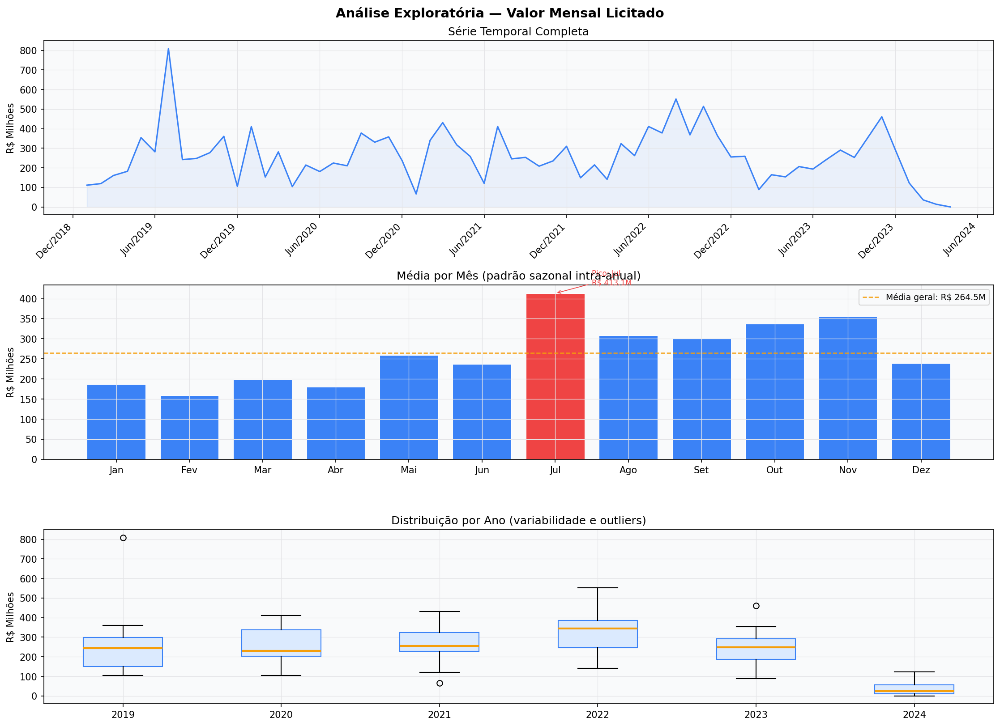
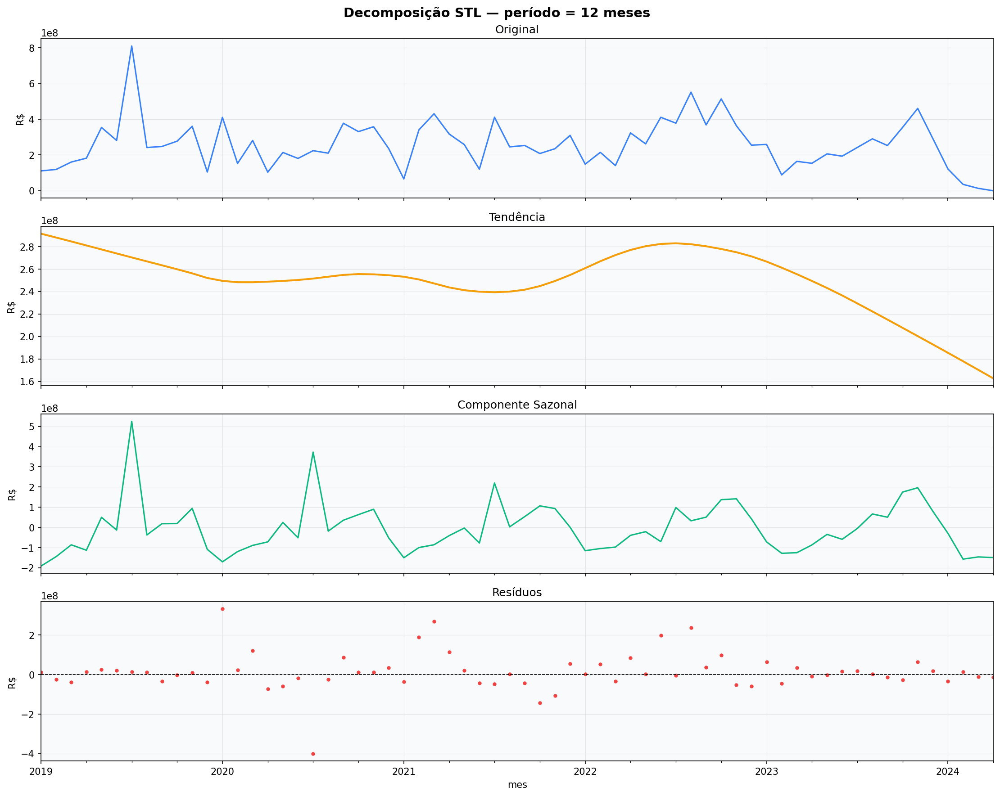
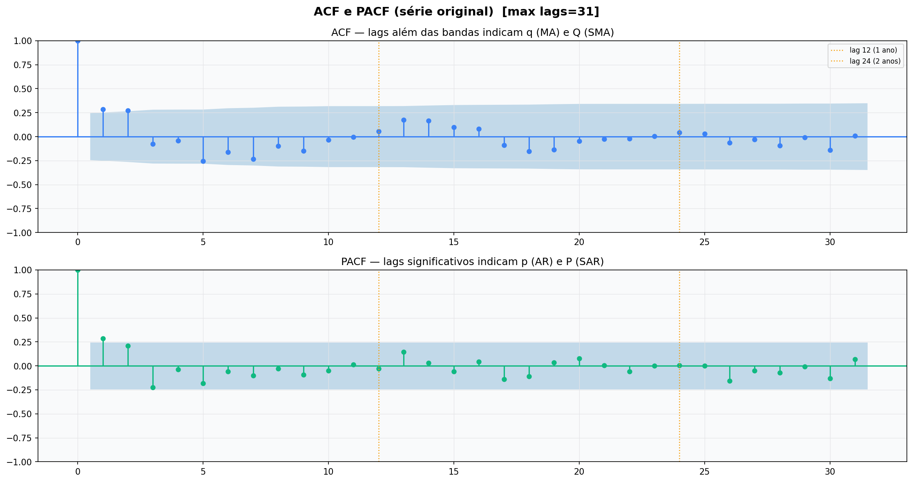
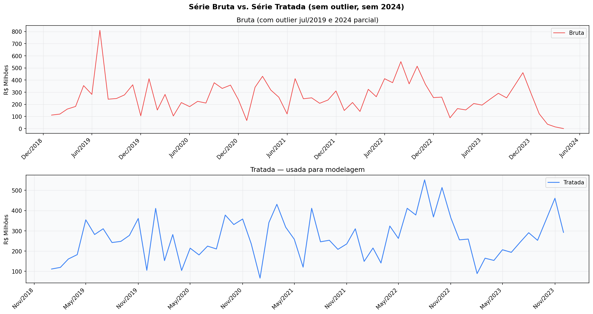
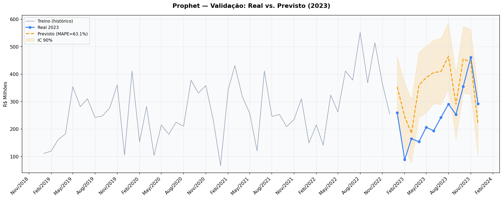
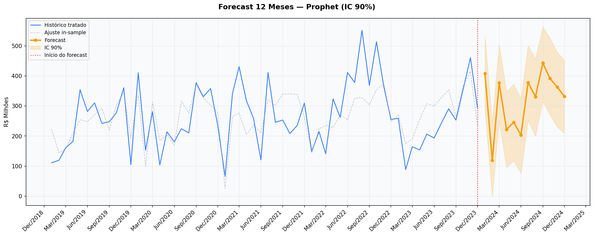

# ETL Databricks — Licitações do Exército Brasileiro (2019–2024)

Pipeline de dados completo para ingestão, transformação, categorização por IA e visualização das licitações do Exército Brasileiro entre 2019 e 2024.

---

## Visão Geral

| Etapa | Tecnologia |
|---|---|
| Extração (API) | Portal da Transparência Gov |
| Processamento | Databricks + Apache Spark |
| Armazenamento | Delta Lake (Bronze / Silver / Gold) |
| Categorização | Google Gemini + Sentence Transformers |
| Visualização | Power BI (PBIP) |
| Previsão | Prophet (séries temporais) |
| Simulação local | Docker + PySpark |

---

## Arquitetura

```
Portal da Transparência API
         │
         ▼
   ┌─────────────┐
   │   BRONZE    │  ← Dados brutos (JSON → Delta)
   └──────┬──────┘
          │
          ▼
   ┌─────────────┐
   │   SILVER    │  ← Limpeza, tipagem, deduplicação
   └──────┬──────┘
          │
          ▼
   ┌─────────────┐
   │    GOLD     │  ← Agregações + categorização por IA
   └──────┬──────┘
          │
    ┌─────┴──────┐
    ▼            ▼
Power BI      Prophet
Dashboard    Forecast
```

---

## Categorização por IA

O notebook [`ETL_Databricks/categorizacao_ia.py`](ETL_Databricks/categorizacao_ia.py) implementa um pipeline de categorização semântica em duas etapas:

1. **Google Gemini** — gera até 25 categorias semânticas a partir das descrições únicas dos itens licitados
2. **Sentence Transformers** (`intfloat/multilingual-e5-large`) — classifica cada item por similaridade de embedding (similaridade de cosseno)

Esse processo cria a tabela `mapa_descricao` que alimenta o dashboard.

---

## Análise de Séries Temporais

O script [`analise_series_temporais.py`](analise_series_temporais.py) realiza:

- Decomposição STL da série de valor mensal de licitações
- Testes de estacionariedade (ADF e KPSS)
- Análise de autocorrelação (ACF / PACF)
- Previsão com modelo **Prophet**

### Resultados

| | |
|---|---|
|  |  |
|  |  |
|  |  |

---

## Estrutura do Projeto

```
.
├── ETL_Databricks/
│   ├── etl_2019.py              # Notebooks Databricks por ano
│   ├── etl_2020.py
│   ├── etl_2021.py
│   ├── etl_2022.py
│   ├── etl_2023.py
│   ├── etl_2024.py
│   ├── categorizacao_ia.py      # Categorização com Gemini + embeddings
│   ├── eda.py                   # Análise exploratória
│   ├── etl_local.py             # ETL completo para execução local (Docker)
│   └── descriptions_unique.csv  # Descrições únicas extraídas
│
├── analise_series_temporais.py  # Análise e previsão com Prophet
├── images/                      # Gráficos gerados pela análise
│
├── Databrick Gov.Report/        # Power BI Report (PBIP)
├── Databrick Gov.SemanticModel/ # Power BI Semantic Model (PBIP)
├── Databrick Gov.pbip           # Arquivo principal Power BI
│
├── Dockerfile                   # Imagem para simulação local
├── docker-compose.yml           # Orquestração do ambiente local
├── requirements.txt             # Dependências Python
└── Data/                        # Camadas Delta Lake (bronze/silver/gold)
```

---

## Como Executar

### No Databricks

1. Importe os notebooks da pasta `ETL_Databricks/` para o seu workspace
2. Configure os secrets no Databricks:
   - `transparencia-scope` / `api-token` — chave da API do Portal da Transparência
   - `escopo_gemini_` / `chave_agrupamento` — chave da API do Google Gemini
3. Execute os notebooks na ordem: `etl_XXXX.py` → `eda.py` → `categorizacao_ia.py`

### Localmente (Docker)

```bash
# Configure as variáveis no arquivo .env (use .env.example como base)
cp .env.example .env

# Suba o ambiente
docker-compose up
```

### Análise de Séries Temporais

```bash
pip install -r requirements.txt
python analise_series_temporais.py
```

---

## Dados

- **Fonte:** [Portal da Transparência — API de Licitações](https://api.portaldatransparencia.gov.br)
- **Órgão:** Exército Brasileiro
- **Período:** 2019 a 2024
- **Volume:** ~7.500 descrições únicas de itens licitados
