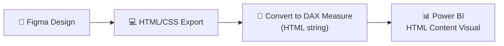

# PBIR/PBIP — Research & Learnings

All patterns, gotchas, and discoveries from hands-on experimentation with Power BI PBIP files.

---

## 1. Project Structure (PBIR Format)

```
projeto.pbip                              ← entry point
├── projeto.Report/
│   ├── definition.pbir                   ← version + semantic model reference
│   ├── definition/
│   │   ├── report.json                   ← themes, settings
│   │   ├── version.json                  ← PBIR version (2.0.0)
│   │   └── pages/
│   │       ├── pages.json                ← page order + active page
│   │       └── <pageId>/
│   │           ├── page.json             ← page definition
│   │           └── visuals/
│   │               └── <visualId>/
│   │                   └── visual.json   ← individual visual
│   └── StaticResources/                  ← themes, images
├── projeto.SemanticModel/
│   └── definition/
│       ├── model.tmdl                    ← data model root
│       ├── database.tmdl                 ← compat level
│       ├── tables/<tableName>.tmdl       ← one file per table
│       └── cultures/pt-BR.tmdl           ← localization
└── .gitignore
```

---

## 2. Color Format — The #1 Gotcha

> [!CAUTION]
> Plain hex strings like `"color": "#FFFFFF"` are **silently ignored** by Power BI Desktop. They get replaced with `"solid": {}` (theme default) on save.

### ❌ Wrong — plain string (silently ignored)
```json
"color": {
  "solid": {
    "color": "#162447"
  }
}
```

### ✅ Correct — Literal expression with single-quoted hex
```json
"color": {
  "solid": {
    "color": {
      "expr": {
        "Literal": {
          "Value": "'#162447'"
        }
      }
    }
  }
}
```

### ✅ Also valid — ThemeDataColor reference (PBI generates this)
```json
"color": {
  "solid": {
    "color": {
      "expr": {
        "ThemeDataColor": {
          "ColorId": 1,
          "Percent": 0
        }
      }
    }
  }
}
```

**Rule**: All property values in PBIR use the `expr → Literal → Value` wrapper. Hex colors must be wrapped in **single quotes** inside the Value string: `"'#FF0000'"`.

---

## 3. TMDL Syntax Patterns

### Calculated Tables

> [!WARNING]
> The keyword `calculatedTable` does NOT exist in TMDL. Use a `partition` block.

```tmdl
table SampleData
    lineageTag: <guid>

    column MyColumn
        lineageTag: <guid>
        isNameInferred
        sourceColumn: [MyColumn]

    measure MyMeasure = SUM(SampleData[Value])
        formatString: #,##0
        lineageTag: <guid>

    partition SampleData = calculated
        mode: import
        source =
                DATATABLE(
                    "MyColumn", STRING,
                    "Value", DOUBLE,
                    {
                        {"Row1", 100},
                        {"Row2", 200}
                    }
                )
```

Key discoveries:
- Use `partition <name> = calculated` + `source =` (not `expression =`)
- Columns use `isNameInferred` + `sourceColumn: [ColumnName]` (with brackets)
- PBI auto-generates `lineageTag` GUIDs for columns on first load
- PBI removes `dataType` from columns — they're inferred from the calculated table

### Multi-line DAX Measures

> [!WARNING]
> `lineageTag` at the same indentation as expression lines gets parsed as DAX!

```tmdl
# ❌ Wrong — lineageTag parsed as part of DAX expression
    measure MyMeasure =
        VAR x = 1
        RETURN x
        lineageTag: <guid>

# ✅ Correct — expression at 3 tabs, properties at 2 tabs
    measure MyMeasure =
            VAR x = 1
            RETURN x
        lineageTag: <guid>
```

**Rule**: Multi-line expressions must be indented **one level deeper** than properties to disambiguate from TMDL keywords.

### Backtick-Fenced DAX Syntax (Discovered in Governança BI)

> [!IMPORTANT]
> Power BI Desktop uses **triple backticks** (`` ``` ``) to fence multi-line DAX in both measures and calculated table partitions. This is an alternative to the indentation-based approach above.

```tmdl
	measure 'Disponibilidade %' = ```
		VAR MinutosIndisponiveisNoContexto = [Total Minutos Indisponíveis]
		VAR DiasNoContexto = COUNTROWS('dCalendario')
		VAR TotalMinutosNoContexto = DiasNoContexto * 1440
		RETURN
		    IF(
		        DiasNoContexto = 0,
		        BLANK(),
		        1 - DIVIDE( MinutosIndisponiveisNoContexto, TotalMinutosNoContexto )
		    )
		```
		formatString: 0.00%;-0.00%;0.00%
		lineageTag: <guid>
```

Also works for calculated table partitions:
```tmdl
	partition dCalendario = calculated
		mode: import
		source = ```
			VAR MinhaDataMinima = MIN('Tabela'[Data])
			VAR MinhaDataMaxima = MAX('Tabela'[Data])
			RETURN
			    ADDCOLUMNS(
			        CALENDAR(MinhaDataMinima, MinhaDataMaxima),
			        "Ano", YEAR([Date]),
			        "Mês Num", MONTH([Date]),
			        "Nome Mês", FORMAT([Date], "mmmm")
			    )
			```
```

> [!TIP]
> The backtick syntax is what PBI Desktop generates when it saves. Both approaches (backticks and indentation-only) work correctly.

### Power Query/M Partitions (`partition = m`)

> [!IMPORTANT]
> Real data sources (SharePoint, SQL, Excel, etc.) use `partition = m` with Power Query/M code — NOT `partition = calculated`.

```tmdl
	partition 'MeuDados' = m
		mode: import
		source =
			let
			    Fonte = SharePoint.Tables("https://site.sharepoint.com/sites/MeuSite", [Implementation="2.0", ViewMode="All"]),
			    #"tabela-id" = Fonte{[Id="tabela-guid-aqui"]}[Items],
			    #"Colunas Removidas" = Table.RemoveColumns(#"tabela-id", {"ID", "Título", "Modificado", "Criado"}),
			    #"Tipo Alterado" = Table.TransformColumnTypes(#"Colunas Removidas", {{"Data", type date}, {"Valor", Int64.Type}})
			in
			    #"Tipo Alterado"

	annotation PBI_NavigationStepName = Navegação
	annotation PBI_ResultType = Table
```

**Partition types**: `calculated` (DAX/DATATABLE), `m` (Power Query/M)

### Calculated Columns (Inline DAX)

Calculated columns use inline DAX directly in the column definition:
```tmdl
	column '% Executado' = 'MinhaTabela'[REALIZADO] / 'MinhaTabela'[PREVISTO]
		formatString: 0.00%;-0.00%;0.00%
		lineageTag: <guid>
		summarizeBy: sum
		annotation SummarizationSetBy = Automatic

	column 'Data Chave' = DATE([ANO], 1, 1)
		formatString: General Date
		lineageTag: <guid>
		summarizeBy: none
		annotation SummarizationSetBy = Automatic
```

### Column Properties (Full Reference)

| Property | Example | Notes |
|----------|---------|-------|
| `dataType` | `string`, `int64`, `double`, `decimal`, `dateTime` | Data type |
| `formatString` | `0`, `0.00%`, `#,0.00`, `Long Date`, `General Date` | Display format |
| `lineageTag` | `<guid>` | Unique identifier |
| `summarizeBy` | `sum`, `none` | Default aggregation |
| `sourceColumn` | `Column Name` | Source column name (without brackets for M sources) |
| `isNameInferred` | (flag) | Auto-inferred name (calculated tables only) |
| `sortByColumn` | `'Mês Num'` | Sort this column by another |
| `dataCategory` | `Years`, `Months`, `DayOfMonth`, `PaddedDateTableDates` | Semantic category |
| `isHidden` | (flag) | Column is hidden from users |
| `changedProperty` | `= DataType`, `= IsHidden`, `= SortByColumn` | Tracks manual changes |

### `variation` Block (Date Column Auto-Hierarchy)

Date columns auto-generate local date tables via `variation`:
```tmdl
	column 'Data Início'
		dataType: dateTime
		formatString: Long Date
		lineageTag: <guid>
		summarizeBy: none
		sourceColumn: Data Início
		variation Variation
			isDefault
			relationship: <relationship-guid>
			defaultHierarchy: LocalDateTable_<guid>.'Hierarquia de datas'
		annotation SummarizationSetBy = Automatic
		annotation UnderlyingDateTimeDataType = Date
```

### `hierarchy` Block (Date Hierarchies)

```tmdl
	hierarchy 'Data da Resposta Hierarquia'
		lineageTag: <guid>

		level 'Data da Resposta'
			lineageTag: <guid>
			column: 'Data da Resposta'

		changedProperty = IsHidden
```

System date tables have a standard 4-level hierarchy:
```tmdl
	hierarchy 'Hierarquia de datas'
		lineageTag: <guid>

		level Ano
			lineageTag: <guid>
			column: Ano

		level Trimestre
			lineageTag: <guid>
			column: Trimestre

		level Mês
			lineageTag: <guid>
			column: Mês

		level Dia
			lineageTag: <guid>
			column: Dia

		annotation TemplateId = DateHierarchy
```

### Table-Level Properties

| Property | Notes |
|----------|-------|
| `isHidden` | Table hidden from users |
| `isPrivate` | System table (e.g., DateTableTemplate) |
| `showAsVariationsOnly` | Auto-generated local date tables |
| `changedProperty = IsHidden` | Tracks manual hide |

> [!WARNING]
> **`isDataTable` does NOT exist in TMDL.** Using it causes `UnknownKeyword` parse error.
> "Mark as date table" is done via Power BI Desktop UI (Modelagem → Marcar como tabela de datas)
> or via annotation. The `dataCategory: Time` on the date column is the only TMDL-side config needed.

> [!WARNING]
> **Power BI reads ALL `.tmdl` files in `tables/`, not just those referenced in `model.tmdl`.**
> If a LocalDateTable file with `showAsVariationsOnly` exists on disk but has no `variation` pointing
> to it (e.g. after you delete the relationship), Power BI will error even if you removed its `ref`
> from `model.tmdl`. Fix: **delete the `.tmdl` file from disk**.

### Annotations (Metadata)

Common PBI-generated annotations:
```tmdl
	annotation SummarizationSetBy = Automatic
	annotation PBI_FormatHint = {"isGeneralNumber":true}
	annotation PBI_FormatHint = {"isDateTimeCustom":true}
	annotation PBI_FormatHint = {"currencyCulture":"pt-BR"}
	annotation UnderlyingDateTimeDataType = Date
	annotation PBI_NavigationStepName = Navegação
	annotation PBI_ResultType = Table
	annotation __PBI_TemplateDateTable = true
	annotation DefaultItem = DateHierarchy
	annotation TemplateId = Year
```

---

## 3.1. Relationships (relationships.tmdl)

```tmdl
relationship <guid>
	fromColumn: 'SourceTable'.'ColumnName'
	toColumn: 'TargetTable'.'ColumnName'
```

### Relationship Properties

| Property | Values | Notes |
|----------|--------|-------|
| `crossFilteringBehavior` | `bothDirections` | Default is single direction (omitted) |
| `joinOnDateBehavior` | `datePartOnly` | Date-only join (ignores time) |
| `toCardinality` | `many` | Many-to-many (default is many-to-one, omitted) |

> [!WARNING]
> **`cardinality: manyToOne` does NOT exist.** Causes `UnknownKeyword` parse error.
> Many-to-one is the default — simply omit the property. Only `toCardinality: many` exists (for many-to-many).

> [!WARNING]
> **When replacing a LocalDateTable relationship with a custom Calendario relationship:**
> 1. Remove the old relationship from `relationships.tmdl`
> 2. Remove the `variation` block from the source column (e.g. `mes/ano`) in its `.tmdl` file —
>    the variation stores the relationship GUID and will cause a dangling-reference error if left
> 3. Delete the orphaned `LocalDateTable_<guid>.tmdl` file from disk (removing `ref` from
>    `model.tmdl` is NOT enough — PBI still reads the file)

### Example: Various Relationship Types
```tmdl
# Simple (many-to-one, single direction)
relationship <guid>
	fromColumn: 'Vendas'.'Data'
	toColumn: 'Calendario'.'Date'

# Bi-directional
relationship <guid>
	crossFilteringBehavior: bothDirections
	fromColumn: 'Categorias'.'Data Chave'
	toColumn: 'Calendario'.'Date'

# Many-to-many + bi-directional
relationship <guid>
	crossFilteringBehavior: bothDirections
	toCardinality: many
	fromColumn: 'Calendario'.'Ano'
	toColumn: 'Dotação'.'Ano'

# Date-only join
relationship <guid>
	joinOnDateBehavior: datePartOnly
	fromColumn: 'Contratos'.'Data Vigência'
	toColumn: LocalDateTable_<guid>.Date
```

---

## 3.2. model.tmdl Extended Reference

```tmdl
model Model
	culture: pt-BR
	defaultPowerBIDataSourceVersion: powerBI_V3
	sourceQueryCulture: pt-BR
	dataAccessOptions
		legacyRedirects
		returnErrorValuesAsNull

annotation PBI_QueryOrder = ["Table1","Table2","Table3"]
annotation __PBI_TimeIntelligenceEnabled = 1
annotation PBI_ProTooling = ["DevMode"]

ref table 'Table1'
ref table 'Table2'
ref table dCalendario

ref cultureInfo pt-BR
```

> [!NOTE]
> `PBI_QueryOrder` controls the order tables appear in Power Query Editor. `PBI_ProTooling = ["DevMode"]` is set for PBIP projects.

---

## 4. Visual Container Schema (v2.6.0)

### Required properties
```json
{
  "$schema": "...visualContainer/2.6.0/schema.json",
  "name": "unique_visual_id",       // required
  "position": {                      // required
    "x": 40, "y": 80,               // required
    "height": 180, "width": 370,    // required
    "z": 1000,                      // stacking order
    "tabOrder": 0                   // keyboard nav
  },
  "visual": { ... }                  // or "visualGroup"
}
```

### Visual Configuration (v2.2.0)

```json
"visual": {
  "visualType": "card",              // required: card, clusteredBarChart, etc.
  "query": {
    "queryState": {
      "Values": {                    // role name (varies by visual type)
        "projections": [{
          "field": {
            "Measure": {
              "Expression": {
                "SourceRef": { "Entity": "TableName" }
              },
              "Property": "MeasureName"
            }
          },
          "queryRef": "TableName.MeasureName"
        }]
      }
    }
  },
  "objects": { ... },                // visual-specific formatting
  "visualContainerObjects": { ... }  // container formatting (bg, border, title)
}
```

### Visual Container Objects (formatting that works)

| Object | Properties | Notes |
|--------|-----------|-------|
| `background` | `show`, `color`, `transparency` | Card background |
| `border` | `show`, `color`, `radius` | Rounded corners with `radius` |
| `title` | `show`, `text`, `fontColor`, `fontSize`, `fontFamily`, `bold` | Visual title |
| `visualHeader` | `show` | Hide the hover header icons |
| `padding` | `top`, `left` | Internal padding |

### Visual-specific Objects (for `card` type)

| Object | Properties | Notes |
|--------|-----------|-------|
| `labels` | `color`, `fontSize`, `fontFamily` | Main value display |
| `categoryLabels` | `show`, `color`, `fontSize` | Subtitle under the value |

### Visual-specific Objects (for `cardVisual` — new card)

> [!IMPORTANT]
> The new `cardVisual` type uses role name `Data` (not `Values` like the old `card`). It also uses `selector: {"id": "default"}` on most objects.

| Object | Properties | Notes |
|--------|-----------|-------|
| `value` | `show`, `horizontalAlignment`, `fontColor` | Main value display |
| `accentBar` | `show`, `position` | Accent decoration bar |
| `outline` | `show` | Card outline |
| `layout` | `rectangleRoundedCurveCustomStyle`, `backgroundShow`, `backgroundFillColor`, `backgroundTransparency` | Card shape/layout |
| `fillCustom` | `fillColor` | Custom fill color |
| `label` | `fontColor` | Category label |

```json
// cardVisual query uses "Data" role (not "Values"):
"query": {
  "queryState": {
    "Data": {
      "projections": [{
        "field": { "Measure": { "Expression": { "SourceRef": { "Entity": "TABLE" } }, "Property": "MEASURE" } },
        "queryRef": "TABLE.MEASURE",
        "nativeQueryRef": "Display Name",
        "displayName": "Display Name"
      }]
    }
  }
}
```

---

## 4.1. Slicer Visual Schema

```json
{
  "$schema": "...visualContainer/2.6.0/schema.json",
  "name": "unique_id",
  "position": { "x": 48, "y": 7, "z": 1000, "height": 50, "width": 686, "tabOrder": 1000 },
  "visual": {
    "visualType": "slicer",
    "query": {
      "queryState": {
        "Values": {
          "projections": [{
            "field": { "Column": { "Expression": { "SourceRef": { "Entity": "TABLE" } }, "Property": "COLUMN" } },
            "queryRef": "TABLE.COLUMN",
            "nativeQueryRef": "COLUMN",
            "active": true
          }]
        }
      }
    },
    "objects": {
      "data": [{
        "properties": {
          "mode": { "expr": { "Literal": { "Value": "'Dropdown'" } } },
          "isInvertedSelectionMode": { "expr": { "Literal": { "Value": "true" } } }
        }
      }],
      "general": [{
        "properties": {
          "orientation": { "expr": { "Literal": { "Value": "0D" } } }
        }
      }],
      "selection": [{
        "properties": {
          "selectAllCheckboxEnabled": { "expr": { "Literal": { "Value": "true" } } },
          "strictSingleSelect": { "expr": { "Literal": { "Value": "false" } } }
        }
      }],
      "items": [{
        "properties": {
          "textSize": { "expr": { "Literal": { "Value": "15D" } } },
          "bold": { "expr": { "Literal": { "Value": "true" } } },
          "fontColor": { "solid": { "color": { "expr": { "ThemeDataColor": { "ColorId": 1, "Percent": 0 } } } } },
          "background": { "solid": { "color": { "expr": { "ThemeDataColor": { "ColorId": 0, "Percent": 0 } } } } }
        }
      }],
      "header": [{
        "properties": {
          "textSize": { "expr": { "Literal": { "Value": "12D" } } },
          "show": { "expr": { "Literal": { "Value": "false" } } }
        }
      }]
    },
    "visualContainerObjects": {
      "background": [{ "properties": { "color": { "solid": { "color": { "expr": { "Literal": { "Value": "'#0097B2'" } } } } } } }],
      "border": [{ "properties": { "show": { "expr": { "Literal": { "Value": "false" } } }, "radius": { "expr": { "Literal": { "Value": "25D" } } } } }],
      "title": [{ "properties": { "show": { "expr": { "Literal": { "Value": "false" } } } } }],
      "padding": [{ "properties": { "left": { "expr": { "Literal": { "Value": "20D" } } }, "top": { "expr": { "Literal": { "Value": "0D" } } } } }],
      "dropShadow": [{ "properties": { "show": { "expr": { "Literal": { "Value": "false" } } } } }]
    },
    "syncGroup": {
      "groupName": "SlicerGroupName",
      "fieldChanges": true,
      "filterChanges": true
    },
    "drillFilterOtherVisuals": true
  },
  "parentGroupName": "parent_group_id"
}
```

### Slicer objects reference

| Object | Property | Values | Notes |
|--------|----------|--------|-------|
| `data` | `mode` | `'Dropdown'`, `'List'` | Display mode |
| `data` | `isInvertedSelectionMode` | `true`/`false` | "Select All" default behavior |
| `general` | `orientation` | `0D` (vertical), `1D` (horizontal) | Slicer orientation |
| `selection` | `selectAllCheckboxEnabled` | `true`/`false` | Show "Select All" checkbox |
| `selection` | `strictSingleSelect` | `true`/`false` | Single selection only |
| `items` | `textSize`, `bold`, `fontColor`, `background` | — | Dropdown item formatting |
| `header` | `textSize`, `show`, `fontColor`, `background` | — | Slicer header formatting |

### `syncGroup` (Cross-Page Slicer Sync)

```json
"syncGroup": {
  "groupName": "Ano",       // Slicers with the same groupName sync across pages
  "fieldChanges": true,      // Sync field changes
  "filterChanges": true      // Sync filter selection changes
}
```

---

## 4.2. Textbox Visual Schema

```json
{
  "$schema": "...visualContainer/2.6.0/schema.json",
  "name": "unique_id",
  "position": { "x": 14, "y": 16, "z": 2000, "height": 35, "width": 50, "tabOrder": 2000 },
  "visual": {
    "visualType": "textbox",
    "objects": {
      "general": [{
        "properties": {
          "paragraphs": [{
            "textRuns": [{
              "value": "My Text Here",
              "textStyle": {
                "fontSize": "12pt",
                "color": "#ffffff"
              }
            }],
            "horizontalTextAlignment": "center"
          }]
        }
      }]
    },
    "visualContainerObjects": {
      "background": [{
        "properties": {
          "color": { "solid": { "color": { "expr": { "Literal": { "Value": "'#0097B2'" } } } } }
        }
      }]
    },
    "drillFilterOtherVisuals": true
  }
}
```

> [!NOTE]
> Textbox uses plain color strings in `textStyle` (not the `expr → Literal → Value` pattern). Only `visualContainerObjects` uses the expression pattern.

---

## 4.3. Shape Visual Schema

```json
{
  "$schema": "...visualContainer/2.6.0/schema.json",
  "name": "unique_id",
  "position": { "x": 0, "y": 0, "z": 0, "height": 547, "width": 746, "tabOrder": 1000 },
  "visual": {
    "visualType": "shape",
    "objects": {
      "shape": [{
        "properties": {
          "tileShape": { "expr": { "Literal": { "Value": "'rectangle'" } } }
        }
      }],
      "rotation": [{
        "properties": {
          "shapeAngle": { "expr": { "Literal": { "Value": "0L" } } },
          "angle": { "expr": { "Literal": { "Value": "270D" } } }
        }
      }],
      "fill": [{
        "properties": {
          "fillColor": { "solid": { "color": { "expr": { "Literal": { "Value": "'#0097B2'" } } } } }
        },
        "selector": { "id": "default" }
      }],
      "outline": [{
        "properties": {
          "lineColor": { "solid": { "color": { "expr": { "Literal": { "Value": "'#007DA4'" } } } } }
        },
        "selector": { "id": "default" }
      }],
      "text": [
        { "properties": { "show": { "expr": { "Literal": { "Value": "true" } } } } },
        {
          "properties": {
            "text": { "expr": { "Literal": { "Value": "'MY TEXT'" } } },
            "fontSize": { "expr": { "Literal": { "Value": "8D" } } },
            "bold": { "expr": { "Literal": { "Value": "true" } } }
          },
          "selector": { "id": "default" }
        }
      ]
    },
    "drillFilterOtherVisuals": true
  }
}
```

### Shape object reference

| Object | Property | Values | Notes |
|--------|----------|--------|-------|
| `shape` | `tileShape` | `'rectangle'`, `'rectangleRounded'` | Shape type |
| `rotation` | `shapeAngle` | `0L` | Rotation in legacy format |
| `rotation` | `angle` | `270D` | Actual rotation degrees |
| `fill` | `fillColor` | Color expr | Background fill |
| `outline` | `lineColor` | Color expr | Border line color |
| `text` | `show`, `text`, `fontSize`, `bold` | — | Text overlay on shape |

> [!NOTE]
> Shape objects use `selector: { "id": "default" }` on `fill`, `outline`, and `text` blocks.

---

## 4.4. Image Visual Schema

```json
{
  "$schema": "...visualContainer/2.6.0/schema.json",
  "name": "unique_id",
  "position": { "x": 0, "y": 0, "z": 4500, "height": 149, "width": 120, "tabOrder": 0 },
  "visual": {
    "visualType": "image",
    "objects": {
      "general": [{
        "properties": {
          "imageUrl": {
            "expr": {
              "ResourcePackageItem": {
                "PackageName": "RegisteredResources",
                "PackageType": 1,
                "ItemName": "MyImage123456789.png"
              }
            }
          }
        }
      }]
    },
    "visualContainerObjects": {
      "title": [{
        "properties": {
          "text": { "expr": { "Literal": { "Value": "'Image Label'" } } }
        }
      }],
      "visualLink": [{
        "properties": {
          "show": { "expr": { "Literal": { "Value": "true" } } },
          "type": { "expr": { "Literal": { "Value": "'PageNavigation'" } } },
          "navigationSection": { "expr": { "Literal": { "Value": "'target_page_name'" } } }
        }
      }]
    },
    "drillFilterOtherVisuals": true
  },
  "howCreated": "InsertVisualButton"
}
```

### Image source: `ResourcePackageItem`

Images are referenced from `report.json` → `resourcePackages`:
```json
// In report.json:
"resourcePackages": [{
  "name": "RegisteredResources",
  "type": "RegisteredResources",
  "items": [
    { "name": "MyImage123456789.png", "path": "MyImage123456789.png", "type": "Image" }
  ]
}]
```

Image files are stored in: `projeto.Report/StaticResources/RegisteredResources/`

### `visualLink` (Page Navigation Action)

```json
"visualLink": [{
  "properties": {
    "show": { "expr": { "Literal": { "Value": "true" } } },
    "type": { "expr": { "Literal": { "Value": "'PageNavigation'" } } },
    "navigationSection": { "expr": { "Literal": { "Value": "'target_page_name'" } } },
    "tooltip": { "expr": { "Literal": { "Value": "'Click to navigate'" } } }
  }
}]
```

---

## 4.5. Visual Group (Container)

```json
{
  "$schema": "...visualContainer/2.6.0/schema.json",
  "name": "group_unique_id",
  "position": { "x": 1568, "y": 83, "z": 4500, "height": 543, "width": 122, "tabOrder": 4000 },
  "visualGroup": {
    "displayName": "Group Display Name",
    "groupMode": "ScaleMode"
  },
  "parentGroupName": "outer_group_id"
}
```

### Nesting visuals in groups: `parentGroupName`

Any visual container can belong to a group by setting `parentGroupName`:
```json
{
  "name": "child_visual_id",
  "position": { ... },
  "visual": { ... },
  "parentGroupName": "group_unique_id"
}
```

Visual groups can be nested (groups inside groups) with `parentGroupName` referencing another group's `name`.

### `howCreated` property

Tracks how the visual was inserted: `"InsertVisualButton"`. This is auto-added by PBI Desktop.

---

## 4.6. Additional Container Objects

| Object | Properties | Notes |
|--------|-----------|-------|
| `dropShadow` | `show` | Drop shadow effect |
| `visualLink` | `show`, `type`, `navigationSection`, `tooltip` | Page navigation action |
| `general` | `keepLayerOrder`, `altText` | Layer order + accessibility |
| `padding` | `top`, `left`, `bottom`, `right` | All use `"ND"` format |

### Dynamic Title from Measure

Visual titles can be driven by a DAX measure instead of static text:
```json
"title": [{
  "properties": {
    "text": {
      "expr": {
        "Measure": {
          "Expression": { "SourceRef": { "Entity": "TABLE" } },
          "Property": "TITLE_MEASURE"
        }
      }
    },
    "fontSize": { "expr": { "Literal": { "Value": "20D" } } },
    "bold": { "expr": { "Literal": { "Value": "true" } } },
    "alignment": { "expr": { "Literal": { "Value": "'center'" } } }
  }
}]
```

---

## 4.7. Selector Patterns (Conditional Formatting)

### `selector: {"id": "default"}`
Used for default formatting on shapes, new cards, etc.:
```json
"fill": [{
  "properties": { "fillColor": { ... } },
  "selector": { "id": "default" }
}]
```

### `selector: {"metadata": "..."}`
Used for coloring data series by their query reference:
```json
"dataPoint": [{
  "properties": { "fill": { "solid": { "color": { "expr": { "Literal": { "Value": "'#0097B2'" } } } } } },
  "selector": { "metadata": "Sum(4 iGovTIC.MÉDIAS ESTADUAIS)" }
}]
```

### `selector: {"data": [...]}` — Conditional by value
Used to color specific data values differently:
```json
"dataPoint": [{
  "properties": { "fill": { "solid": { "color": { "expr": { "Literal": { "Value": "'#00C800'" } } } } } },
  "selector": {
    "data": [{
      "scopeId": {
        "Comparison": {
          "ComparisonKind": 0,
          "Left": {
            "Column": {
              "Expression": { "SourceRef": { "Entity": "TABLE" } },
              "Property": "COLUMN"
            }
          },
          "Right": { "Literal": { "Value": "'ValueToMatch'" } }
        }
      }
    }]
  }
}]
```

`ComparisonKind`: 0 = Equal

---

## 4.8. Chart Visual Objects Reference

### Chart query roles

| Visual Type | Roles |
|-------------|-------|
| `clusteredColumnChart` | `Category`, `Y`, `Series` |
| `lineClusteredColumnComboChart` | `Category`, `Y`, `Y2` |
| `lineStackedColumnComboChart` | `Category`, `Y`, `Y2` |
| `card` | `Values` |
| `cardVisual` (new) | `Data` |
| `slicer` | `Values` |
| `htmlContent...` | `content` |
| `deneb...` | `dataset` |

### Common chart objects

| Object | Key Properties |
|--------|---------------|
| `categoryAxis` | `fontSize`, `bold`, `labelColor`, `showAxisTitle`, `gridlineShow`, `innerPadding` |
| `valueAxis` | `fontSize`, `bold`, `show`, `showAxisTitle`, `secShow` (secondary), `labelPrecision` |
| `labels` | `show`, `fontSize`, `bold`, `color`, `labelDensity`, `labelPosition` (`'OutsideEnd'`) |
| `legend` | `show`, `showTitle`, `position` (`'TopRight'`), `labelColor` |
| `dataPoint` | `fill` (with optional `selector`) |
| `lineStyles` | `strokeWidth`, `lineChartType` (`'linear'`), `strokeLineJoin` |
| `zoom` | `show`, `showOnValueAxis` |

### Reference Lines (`y1AxisReferenceLine`)

```json
"y1AxisReferenceLine": [{
  "properties": {
    "show": { "expr": { "Literal": { "Value": "true" } } },
    "displayName": { "expr": { "Literal": { "Value": "'Meta'" } } },
    "value": { "expr": { "Literal": { "Value": "90D" } } },
    "lineColor": { "solid": { "color": { "expr": { "Literal": { "Value": "'#00E600'" } } } } },
    "transparency": { "expr": { "Literal": { "Value": "0D" } } },
    "dataLabelShow": { "expr": { "Literal": { "Value": "true" } } },
    "dataLabelText": { "expr": { "Literal": { "Value": "'Name'" } } },
    "dataLabelColor": { "solid": { "color": { "expr": { "Literal": { "Value": "'#00EA00'" } } } } }
  },
  "selector": { "id": "2" }
}]
```

Multiple reference lines use sequential `selector.id`: `"2"`, `"3"`, `"4"`, etc.

### `HierarchyLevel` field type (for chart axes)

```json
"field": {
  "HierarchyLevel": {
    "Expression": {
      "Hierarchy": {
        "Expression": { "SourceRef": { "Entity": "TABLE" } },
        "Hierarchy": "HierarchyName"
      }
    },
    "Level": "LevelName"
  }
}
```

### `Aggregation` field type (explicit aggregation)

```json
"field": {
  "Aggregation": {
    "Expression": {
      "Column": {
        "Expression": { "SourceRef": { "Entity": "TABLE" } },
        "Property": "COLUMN"
      }
    },
    "Function": 0
  }
}
```

`Function`: 0 = Sum, 1 = Avg, 2 = Min, 3 = Max, 4 = Count, 5 = CountNonNull

## 5. Page Schema (v2.0.0)

> [!WARNING]
> The old `config` property is **invalid** in PBIR v2.0.0 — use `objects` instead.

```json
{
  "$schema": "...page/2.0.0/schema.json",
  "name": "dashboard01",
  "displayName": "Dashboard",
  "displayOption": "FitToPage",
  "height": 720,
  "width": 1280,
  "pageBinding": {
    "name": "hex_id_here",
    "type": "Default",
    "parameters": []
  },
  "objects": {
    "background": [
      {
        "properties": {
          "color": {
            "solid": {
              "color": {
                "expr": {
                  "Literal": { "Value": "'#1B1B2F'" }
                }
              }
            }
          }
        }
      }
    ],
    "outspace": [
      {
        "properties": {
          "color": {
            "solid": {
              "color": {
                "expr": {
                  "Literal": { "Value": "'#1B1B2F'" }
                }
              }
            }
          }
        }
      }
    ]
  }
}
```

> [!NOTE]
> `pageBinding` is auto-generated by PBI Desktop. `outspace` controls the color outside the page area (when the viewport is larger than the page).

---

## 6. Pages Metadata

```json
{
  "$schema": "...pagesMetadata/1.0.0/schema.json",
  "pageOrder": ["page1_id", "page2_id"],
  "activePageName": "page2_id"
}
```

- Page/visual IDs can be human-readable names (e.g., `dashboard01`)
- PBI preserves your custom names after save

---

## 7. HTML Content Visual — Deep Dive

### Available Visuals (4 Options)

| Visual | Developer | Certified | External URLs | Export PDF/PPT |
|--------|-----------|-----------|---------------|----------------|
| **HTML Content (Lite)** | Daniel Marsh-Patrick | ✅ Yes | ❌ No | ✅ Yes |
| **HTML Content (Regular)** | Daniel Marsh-Patrick | ❌ No | ✅ Yes | ❌ No |
| **HTML VizCreator Cert** | BI Samurai | ✅ Yes | ❌ No | ✅ Yes |
| **HTML VizCreator Flex** | BI Samurai | ❌ No | ✅ Yes | ❌ No |

> [!TIP]
> For the **Figma → HTML/CSS → Power BI** workflow, start with **HTML Content (Regular)** for maximum flexibility. Switch to Lite/Cert for production reports that need PDF export.

### Supported CSS Features

Since the visual renders in a **browser sandbox**, it supports virtually all modern CSS:

| Feature | Supported | Notes |
|---------|-----------|-------|
| **Flexbox** | ✅ | Full support for layouts |
| **CSS Grid** | ✅ | Complex grid layouts work |
| **Gradients** | ✅ | `linear-gradient`, `radial-gradient` |
| **Box Shadows** | ✅ | `box-shadow` for depth effects |
| **Border Radius** | ✅ | Rounded corners |
| **CSS Animations** | ✅ | `@keyframes`, `transition` |
| **Custom Fonts** | ⚠️ | Inline `@font-face` with data URLs only (certified) |
| **SVG** | ✅ | All tags except `<use>`, `<script>`, `<foreignObject>` |
| **Images** | ⚠️ | Data URLs only (certified) / External URLs (uncertified) |
| **Backdrop Filter** | ✅ | Glassmorphism effects |
| **CSS Variables** | ✅ | `var(--custom-prop)` |

### Supported HTML Tags (Lite/Certified)

`<a>`, `<div>`, `<span>`, `<p>`, `<h1>`-`<h6>`, `<table>`, `<tr>`, `<td>`, `<th>`,
`<ul>`, `<ol>`, `<li>`, `` (data URLs), `<br>`, `<hr>`, `<strong>`, `<em>`,
`<b>`, `<i>`, `<u>`, `<code>`, `<pre>`, `<blockquote>`, `<sub>`, `<sup>`, all SVG tags

### Limitations

- **Sandbox**: Runs in an iframe with `null://` origin — no access to `powerbi.com` DOM
- **CORS**: Cannot embed content from sites with CORS restrictions
- **PBI Desktop vs Service**: Rendering may differ (Desktop is not a full browser)
- **Performance**: Re-renders entirely on every slicer/filter change
- **No JavaScript**: Cannot execute `<script>` tags (security)
- **No external URLs** in certified versions (images must be base64 data URLs)
- `<a href="#bookmark">` links don't work (sandbox has no origin)

### How Data Flows: DAX → HTML

```
DAX Measure → returns HTML string → HTML Content visual renders it
```

The visual accepts **one field** that contains an HTML string. This can be:
1. A DAX **measure** that builds HTML dynamically from data
2. A **column** in a table containing pre-built HTML strings
3. A **calculated column** combining data + HTML formatting

### Figma → HTML/CSS → Power BI Workflow



**Step-by-step:**
1. Design the visual card/component in **Figma**
2. Export as **HTML/CSS** (manually or via Figma plugins)
3. Convert the HTML to a **DAX measure** that returns the HTML string
4. Parameterize the HTML with DAX expressions (swap hardcoded values with `FORMAT([Measure], ...)`)
5. Add the **HTML Content visual** to your report
6. Bind the DAX measure to the visual's data field
7. Extract the resulting `visual.json` as a **template for code generation**

---

## 8. PBI Desktop Behavior on Load

What PBI Desktop does when it opens a PBIP project:

1. **Validates JSON** against the declared `$schema`
2. **Strips unrecognized properties** (e.g., `config` → error)
3. **Replaces plain color strings** with `"solid": {}` (theme default)
4. **Regenerates column definitions** with `isNameInferred`, auto lineageTags
5. **Adds `filterConfig`** blocks to visuals automatically
6. **Re-indents JSON** to 2-space indentation
7. **Reorders certain properties** (e.g., `height` before `width`)

---

## 9. JSON Schemas Reference

All schemas published at: [github.com/microsoft/json-schemas/fabric/item/report/definition](https://github.com/microsoft/json-schemas/tree/main/fabric/item/report/definition)

| Schema | Version | Purpose |
|--------|---------|---------|
| `visualContainer` | 2.6.0 | Individual visual definition |
| `visualConfiguration` | 2.2.0 | Visual type, query, objects |
| `page` | 2.0.0 | Page layout and background |
| `pagesMetadata` | 1.0.0 | Page ordering |
| `report` | 3.1.0 | Report settings, themes |
| `versionMetadata` | 1.0.0 | PBIR format version |
| `formattingObjectDefinitions` | 1.4.0 | Formatting property types |
| `semanticQuery` | 1.3.0 | Data query expressions |

---

## 10. Useful DAX Patterns for Code Generation

### Calculated table with sample data
```dax
DATATABLE(
    "Column1", STRING,
    "Column2", DOUBLE,
    {
        {"value1", 100},
        {"value2", 200}
    }
)
```

### HTML measure for HTML Content visual
```dax
"<div style='...'>" &
"<h2>" & FORMAT([Measure], "#,##0") & "</h2>" &
"</div>"
```

---

## 11. HTML Content Visual — Template (Extracted from PBI Desktop)

> [!IMPORTANT]
> This is the exact JSON that Power BI Desktop generates for the HTML Content visual. Use this as a reusable template for code generation.

### visual.json Template
```json
{
  "$schema": "https://developer.microsoft.com/json-schemas/fabric/item/report/definition/visualContainer/2.6.0/schema.json",
  "name": "YOUR_UNIQUE_ID_HERE",
  "position": {
    "x": 40,
    "y": 310,
    "z": 2001,
    "height": 180,
    "width": 280,
    "tabOrder": 2001
  },
  "visual": {
    "visualType": "htmlContent443BE3AD55E043BF878BED274D3A6855",
    "query": {
      "queryState": {
        "content": {
          "projections": [
            {
              "field": {
                "Measure": {
                  "Expression": {
                    "SourceRef": {
                      "Entity": "TABLE_NAME"
                    }
                  },
                  "Property": "MEASURE_NAME"
                }
              },
              "queryRef": "TABLE_NAME.MEASURE_NAME",
              "nativeQueryRef": "MEASURE_NAME"
            }
          ]
        }
      }
    },
    "visualContainerObjects": {
      "background": [
        {
          "properties": {
            "show": {
              "expr": { "Literal": { "Value": "true" } }
            },
            "transparency": {
              "expr": { "Literal": { "Value": "100D" } }
            }
          }
        }
      ]
    },
    "drillFilterOtherVisuals": true
  }
}
```

Key differences from built-in card visual:
- `visualType`: `htmlContent443BE3AD55E043BF878BED274D3A6855` (unique ID for the public visual)
- Query role: `content` (not `Values` like cards)
- Has `nativeQueryRef` in projections
- Background transparency: `100D` (fully transparent — the HTML provides its own background)
- Has `drillFilterOtherVisuals: true`

---

## 12. Custom Visual Registration in report.json

Custom visuals (from AppSource marketplace) are registered in `report.json`:

```json
{
  "publicCustomVisuals": [
    "htmlContent443BE3AD55E043BF878BED274D3A6855"
  ]
}
```

> [!IMPORTANT]
> To programmatically add an HTML Content visual, you must ALSO add the visual type ID to the `publicCustomVisuals` array in `report.json`. Without this, PBI won't recognize the visual type.

The visual type ID format: `htmlContent` + `443BE3AD55E043BF878BED274D3A6855` (AppSource GUID).

### Resource Packages (Images, Themes) in report.json

```json
{
  "resourcePackages": [
    {
      "name": "SharedResources",
      "type": "SharedResources",
      "items": [{
        "name": "CY24SU06",
        "path": "BaseThemes/CY24SU06.json",
        "type": "BaseTheme"
      }]
    },
    {
      "name": "RegisteredResources",
      "type": "RegisteredResources",
      "items": [
        { "name": "MyImage123456789.png", "path": "MyImage123456789.png", "type": "Image" },
        { "name": "MyTheme5193027847108278.json", "path": "MyTheme5193027847108278.json", "type": "Image" }
      ]
    }
  ]
}
```

- `SharedResources`: Base themes stored in `StaticResources/SharedResources/BaseThemes/`
- `RegisteredResources`: Custom images + themes stored in `StaticResources/RegisteredResources/`
- Image files referenced via `ResourcePackageItem` in image visual `objects.general.imageUrl`

---

## 13. PBI Desktop Auto-Normalization Patterns

When Power BI Desktop opens and saves a PBIP project, it normalizes several things:

### z-index (`z` property)
- PBI uses **increments of ~1000** for z-ordering
- First visual: `z: 0`, second: `z: 1000`, third: `z: 2000`, new: `z: 2001`
- Our original `z: 1000` for all 3 cards was renumbered to 0, 1000, 2000

### Tab Order (`tabOrder` property)
- Also uses **increments of 1000**: 0, 1000, 2000
- Our original `tabOrder: 0, 1, 2` was renumbered to 0, 1000, 2000

### filterConfig
- PBI **auto-generates** a `filterConfig` block for each visual
- Contains a unique `name` (hex ID) and the bound field reference
- Filter `type` is typically `"Advanced"`

### Summary of auto-generated properties
| Property | Behavior |
|----------|----------|
| `z` | Renumbered with 1000 increments |
| `tabOrder` | Renumbered with 1000 increments |
| `filterConfig` | Auto-added with unique name |
| `drillFilterOtherVisuals` | Set to `true` by default |
| `howCreated` | Set to `"InsertVisualButton"` on new visuals |
| `pageBinding` | Auto-added to pages with name/type/parameters |
| Column `isNameInferred` | Added to calculated table columns |
| Column `sourceColumn` | Wrapped in brackets: `[ColumnName]` |
| Column `annotation SummarizationSetBy` | Set to `Automatic` |
| Column `changedProperty` | Tracks manual changes (DataType, IsHidden, etc.) |
| TMDL `expression` | Changed to `source` in calculated partitions |
| JSON indentation | Normalized to 2-space indent |

---

## 14. Using SVG Icon Libraries (Lucide / Heroicons / Feather)

> [!TIP]
> Inline SVG icons are the **best replacement for emojis** in HTML Content visuals. They're crisp, scalable, color-customizable, and work in both certified and uncertified versions.

### Why SVG icons > Emojis
- ✅ Consistent rendering across PBI Desktop and Service
- ✅ Color-customizable via `stroke` attribute
- ✅ Scales perfectly at any size
- ✅ Works in certified HTML Content (Lite)
- ❌ Emojis can look different across OS/browsers

### Template: Inline SVG Icon
```html
<svg width='16' height='16' viewBox='0 0 24 24'
  fill='none' stroke='#A78BFA' stroke-width='2'
  stroke-linecap='round' stroke-linejoin='round'>
  <!-- path data here -->
</svg>
```

### Icon Reference (Lucide icons used in our cards)

| Icon | Name | SVG Path | Used In |
|------|------|----------|---------|
| 💲 | DollarSign | `<line x1='12' y1='1' x2='12' y2='23'/><path d='M17 5H9.5a3.5 3.5 0 0 0 0 7h5a3.5 3.5 0 0 1 0 7H6'/>` | HtmlGlassCard |
| 👥 | Users | `<path d='M16 21v-2a4 4 0 0 0-4-4H6a4 4 0 0 0-4 4v2'/><circle cx='9' cy='7' r='4'/><path d='M22 21v-2a4 4 0 0 0-3-3.87'/><path d='M16 3.13a4 4 0 0 1 0 7.75'/>` | HtmlNeonCard |
| 🎯 | Target | `<circle cx='12' cy='12' r='10'/><circle cx='12' cy='12' r='6'/><circle cx='12' cy='12' r='2'/>` | HtmlProgressCard |
| 📊 | BarChart2 | `<line x1='18' y1='20' x2='18' y2='10'/><line x1='12' y1='20' x2='12' y2='4'/><line x1='6' y1='20' x2='6' y2='14'/>` | HtmlSparkCard |
| 💓 | Activity | `<polyline points='22 12 18 12 15 21 9 3 6 12 2 12'/>` | HtmlStatusCard |
| ✓ | Check | `<polyline points='20 6 9 17 4 12'/>` | HtmlGaugeCard |

### DAX Pattern: Icon + Label
```dax
"<div style='display:flex; align-items:center; gap:8px;'>" &
"<svg width='16' height='16' viewBox='0 0 24 24' fill='none' stroke='#A78BFA' stroke-width='2' stroke-linecap='round'>" &
"<line x1='12' y1='1' x2='12' y2='23'/>" &
"<path d='M17 5H9.5a3.5 3.5 0 0 0 0 7h5a3.5 3.5 0 0 1 0 7H6'/>" &
"</svg>" &
"<span style='font-size:11px; color:rgba(255,255,255,0.5);'>Receita</span></div>"
```

### Component Libraries in HTML Content Visual

| Library | Works? | Notes |
|---------|--------|-------|
| **Lucide SVG** | ✅ | Inline paths, no CDN needed |
| **Animate.css** | ✅ | Paste `@keyframes` in `<style>` block |
| **Google Fonts** | ⚠️ | `@import url(...)` — uncertified only |
| **Bootstrap CSS** | ⚠️ | Inline the CSS — no JS components |
| React/Vue/Angular | ❌ | Require JavaScript (blocked in sandbox) |
| D3.js / Chart.js | ❌ | Require JavaScript |

---

## 15. Responsive / Dynamic Sizing in HTML Content Visuals

> [!CAUTION]
> **MANDATORY RULE**: ALL HTML Content visuals must ALWAYS use responsive sizing. Never use fixed `px` values alone. Always wrap with `min()`, `clamp()`, or use viewport units.

> [!IMPORTANT]
> The HTML Content visual renders inside its own **iframe**. This means `100vh` = full visual height and `100vw` = full visual width. Use these to make HTML fill any container size.

### The Responsive Root Container (Required for EVERY card)
```css
/* ALWAYS start every card with this on the root div */
width: 100%;
height: 100vh;
box-sizing: border-box;
display: flex;
flex-direction: column;
justify-content: center;    /* or align-items:center for horizontal */
padding: min(24px, 4vh) min(24px, 4vw);
```

### CSS Functions Reference

| Function | Syntax | Best For |
|----------|--------|----------|
| `min()` | `min(28px, 6vw)` | Cap max size — shrinks on small containers |
| `max()` | `max(12px, 2vw)` | Cap min size — grows on large containers |
| `clamp()` | `clamp(10px, 3vw, 20px)` | Both min and max bounds |
| `100vh` | `height: 100vh` | Fill full container height |
| `100vw` | `width: 100vw` | Fill full container width |

### DAX Example: Responsive Gauge Card
```dax
"<div style='...height:100vh; display:flex; flex-direction:column; justify-content:center;'>" &
"<div style='width:min(120px,30vw,30vh); height:min(120px,30vw,30vh);'>" &
"<svg width='100%' height='100%' viewBox='0 0 120 120'>...</svg>" &
"</div></div>"
```

**Key**: SVG with `width='100%' height='100%'` + `viewBox` scales perfectly at any size.

---

## 16. HTML-to-DAX Conversion Patterns

### Conversion Checklist
1. ✅ Use **single quotes** for all HTML attributes (`style='...'` not `style="..."`)
2. ✅ Each line → a DAX string concatenated with `&`
3. ✅ Replace hardcoded values with `FORMAT([Measure], "pattern")`
4. ✅ CSS classes → **inline styles** (or use `<style>` block for animations)
5. ✅ `::before`/`::after` → nested `<div>` elements
6. ✅ `:hover` effects → **don't work** in PBI (no JS for interactions)
7. ✅ Wrap measure in `VAR`/`RETURN` for readability

### DAX String Escaping Rules

| Character | In DAX String | Notes |
|-----------|--------------|-------|
| Double quote `"` | `""` | Doubled inside DAX strings |
| Single quote `'` | `'` | Works normally — **use for HTML** |
| Ampersand `&` | `&` (in HTML) / `&` (DAX concat) | Context matters |
| Line break | Not needed | HTML ignores whitespace |

### Template: Complete DAX HTML Measure
```tmdl
	measure HtmlMyCard =
			VAR _valor = [MyMeasure]
			VAR _meta = 1000
			VAR _percent = DIVIDE(_valor, _meta, 0) * 100
			RETURN
			"<div style='font-family:Segoe UI,sans-serif; background:#12121F; border-radius:16px; padding:24px; color:white; width:100%; height:100vh; box-sizing:border-box; display:flex; flex-direction:column; justify-content:center;'>" &
			"<p style='margin:0 0 8px; font-size:12px; color:#6B7280;'>Label</p>" &
			"<div style='font-size:28px; font-weight:700;'>" & FORMAT(_valor, "#,##0") & "</div>" &
			"<div style='background:rgba(255,255,255,0.06); border-radius:6px; height:8px; margin-top:12px;'>" &
			"<div style='height:100%; border-radius:6px; background:linear-gradient(90deg,#8B5CF6,#06B6D4); width:" & FORMAT(_percent, "0") & "%;'></div></div>" &
			"</div>"
		lineageTag: XXXXXXXX-XXXX-XXXX-XXXX-XXXXXXXXXXXX
```

### Common FORMAT Patterns
| Format | Example | Output |
|--------|---------|--------|
| `"#,##0"` | `FORMAT(1250000, "#,##0")` | `1.250.000` |
| `"0.0"` | `FORMAT(94.5, "0.0")` | `94,5` |
| `"0"` | `FORMAT(85.7, "0")` | `86` |
| `"R$ #,##0"` | `FORMAT(1250000, "R$ #,##0")` | `R$ 1.250.000` |
| `"0.0%"` | `FORMAT(0.945, "0.0%")` | `94,5%` |

---

## 17. Card Design Catalog (7 Proven Designs)

All designs tested and working in Power BI HTML Content visual:

### 1. Glassmorphism Card
- **Look**: Frosted glass, radial gradient glow, gradient text
- **CSS**: `backdrop-filter:blur(20px)`, `rgba` backgrounds, `-webkit-background-clip:text`
- **Measure**: `HtmlGlassCard`

### 2. Neon Glow Card
- **Look**: Bottom gradient bar, icon circle, percentage badge
- **CSS**: `linear-gradient` bottom bar via `position:absolute; bottom:0`, rounded icon with `box-shadow` glow
- **Measure**: `HtmlNeonCard`

### 3. Progress Bar Card
- **Look**: Horizontal progress bar, percentage, remaining info
- **CSS**: Nested `<div>` with `width:N%`, `linear-gradient` fill, `flexbox` meta row
- **Measure**: `HtmlProgressCard`

### 4. Sparkline Card
- **Look**: Mini bar chart, trend indicator
- **CSS**: `flexbox` with `align-items:flex-end`, each bar `height:N%`, `linear-gradient(to top, ...)`
- **Measure**: `HtmlSparkCard`

### 5. Status Grid Card
- **Look**: Pulsing dot, 2×2 metrics grid
- **CSS**: `@keyframes` animation, `display:grid; grid-template-columns:1fr 1fr`
- **Measure**: `HtmlStatusCard`
- **Note**: Uses `<style>` block for `@keyframes` — works in uncertified version

### 6. SVG Gauge Ring
- **Look**: Circular progress ring, percentage center
- **CSS/SVG**: `stroke-dasharray` + `stroke-dashoffset` for arc, `linearGradient` for color
- **Math**: `dashoffset = 339.292 × (1 - percent/100)` where `339.292 = 2πr` (r=54)
- **Measure**: `HtmlGaugeCard`

### 7. Original Gradient Card
- **Look**: Purple gradient background, progress bar, meta text
- **CSS**: `linear-gradient(135deg, ...)`, `box-shadow` for depth
- **Measure**: `HtmlCardReceita`

### Design System — Color Palette

| Role | Color | Hex |
|------|-------|-----|
| Page Background | Very dark | `#0F0F1A` or `#1B1B2F` |
| Card Background | Dark blue | `#12121F` or `#162447` |
| Card Border | Subtle | `#1E1E3A` or `rgba(255,255,255,0.04)` |
| Primary Text | White | `#FFFFFF` |
| Secondary Text | Muted | `#9CA3AF` or `#6B7280` |
| Accent Purple | Violet | `#8B5CF6` or `#6366F1` |
| Accent Cyan | Teal | `#06B6D4` or `#00D9FF` |
| Accent Green | Success | `#4ADE80` |
| Accent Red | Error | `#F87171` |
| Accent Gold | Warning | `#FFD700` |
| Accent Pink | Highlight | `#EC4899` or `#E43F5A` |

---

## 18. Semantic Model Patterns (TMDL)

### Complete Table Structure
```tmdl
table TableName
	lineageTag: <guid>

	// --- Measures ---
	measure SimpleMeasure = SUM(TableName[Column])
		formatString: #,##0
		lineageTag: <guid>

	measure FilteredMeasure = CALCULATE(SUM(TableName[Value]), TableName[Category] = "X")
		formatString: R$ #,##0
		lineageTag: <guid>

	// Multi-line DAX with backtick fencing (preferred by PBI Desktop)
	measure ComplexMeasure = ```
		VAR _x = [SimpleMeasure]
		VAR _total = CALCULATE([SimpleMeasure], ALL(TableName))
		RETURN
		    DIVIDE(_x, _total, 0)
		```
		formatString: 0.00%;-0.00%;0.00%
		lineageTag: <guid>

	// Multi-line DAX with indentation-only
	measure HtmlMeasure =
			VAR _x = [SimpleMeasure]
			RETURN
			"<div>" & FORMAT(_x, "#,##0") & "</div>"
		lineageTag: <guid>

	// --- Calculated Columns ---
	column PercentColumn = TableName[Realizado] / TableName[Previsto]
		formatString: 0.00%;-0.00%;0.00%
		lineageTag: <guid>
		summarizeBy: sum
		annotation SummarizationSetBy = Automatic

	column DateKey = DATE([Ano], 1, 1)
		formatString: General Date
		lineageTag: <guid>
		summarizeBy: none
		annotation SummarizationSetBy = Automatic

	// --- Columns (from data source or calculated table) ---
	column ColumnName
		dataType: string
		lineageTag: <guid>
		summarizeBy: none
		sourceColumn: Column Name
		annotation SummarizationSetBy = Automatic

	column DateColumn
		dataType: dateTime
		formatString: Long Date
		lineageTag: <guid>
		summarizeBy: none
		sourceColumn: Date Column
		variation Variation
			isDefault
			relationship: <relationship-guid>
			defaultHierarchy: LocalDateTable_<guid>.'Hierarquia de datas'
		annotation SummarizationSetBy = Automatic
		annotation UnderlyingDateTimeDataType = Date

	column SortedColumn
		lineageTag: <guid>
		summarizeBy: none
		sourceColumn: Month Name
		sortByColumn: MonthNumber
		annotation SummarizationSetBy = Automatic

	// --- Columns (auto-generated by PBI for calculated tables) ---
	column InferredColumn
		lineageTag: <guid>
		isNameInferred
		sourceColumn: [InferredColumn]

	// --- Partition: Calculated (DAX) ---
	partition TableName = calculated
		mode: import
		source =
				DATATABLE(
					"Column1", STRING,
					"Column2", DOUBLE,
					{
						{"Row1", 100},
						{"Row2", 200}
					}
				)

	// --- Partition: M (Power Query - real data sources) ---
	// partition TableName = m
	//     mode: import
	//     source =
	//         let
	//             Fonte = SharePoint.Tables("https://site.sharepoint.com/sites/MySite"),
	//             Table = Fonte{[Id="guid"]}[Items]
	//         in
	//             Table

	annotation PBI_NavigationStepName = Navegação
	annotation PBI_ResultType = Table
```

### TMDL Indentation Rules (Critical!)

| Element | Indentation |
|---------|-------------|
| `table` keyword | 0 tabs |
| Properties (`lineageTag`) | 1 tab |
| `measure`, `column`, `partition` | 1 tab |
| Measure properties (`formatString`, `lineageTag`) | 2 tabs |
| Multi-line DAX expressions | 3 tabs |
| Partition `source =` expression | 4 tabs |

> [!CAUTION]
> If a multi-line DAX expression shares the same indentation as `lineageTag`, PBI parses `lineageTag` as DAX code and throws a syntax error!

### DAX Patterns for Measures

```dax
// Simple aggregation
SUM(Table[Column])

// Filtered aggregation
CALCULATE(SUM(Table[Value]), Table[Category] = "X")

// Percentage calculation
DIVIDE([Measure1], [Measure2], 0) * 100

// Difference from target
VAR _valor = [ActualMeasure]
VAR _meta = CALCULATE(SUM(Table[Meta]), Table[Cat] = "X")
RETURN DIVIDE(_valor - _meta, _meta, 0) * 100

// SVG gauge math (circle circumference)
VAR _percent = [MyPercent]
VAR _circumference = 339.292   // 2 × π × radius (r=54)
VAR _dashoffset = _circumference * (1 - _percent / 100)
```

### model.tmdl Reference
```tmdl
model Model
	culture: pt-BR
	defaultPowerBIDataSourceVersion: powerBI_V3
	sourceQueryCulture: pt-BR
	dataAccessOptions
		legacyRedirects
		returnErrorValuesAsNull

annotation PBI_QueryOrder = ["Table1","Table2","Table3"]
annotation __PBI_TimeIntelligenceEnabled = 1
annotation PBI_ProTooling = ["DevMode"]

ref table TableName
ref table 'Table With Spaces'

ref cultureInfo pt-BR
```

> [!NOTE]
> Each table gets its own `.tmdl` file in `definition/tables/`. The `model.tmdl` only contains `ref table` references. Table names with spaces must be wrapped in single quotes. `PBI_QueryOrder` controls order in Power Query Editor.

---

## 19. Quick Reference — Files to Edit for Common Tasks

| Task | Files to Edit |
|------|--------------|
| Add new page | `pages/<id>/page.json` + `pages/pages.json` |
| Add built-in visual | `pages/<page>/visuals/<id>/visual.json` |
| Add HTML Content visual | Same as above + `report.json` (`publicCustomVisuals`) |
| Add image visual | visual.json + `report.json` (`resourcePackages`) + image file in `StaticResources/RegisteredResources/` |
| Add slicer | visual.json (+ `syncGroup` for cross-page sync) |
| Add visual group | visual.json with `visualGroup` + set `parentGroupName` on child visuals |
| Add DAX measure | `tables/<table>.tmdl` |
| Add calculated column | `tables/<table>.tmdl` (inline DAX in column definition) |
| Add new table | `tables/<name>.tmdl` + `model.tmdl` (`ref table`) |
| Add relationship | `relationships.tmdl` |
| Change page background | `pages/<id>/page.json` → `objects.background` |
| Change active page | `pages/pages.json` → `activePageName` |
| Change theme | `report.json` → `themeCollection` |
| Add page navigation | visual.json → `visualContainerObjects.visualLink` |
| Add reference line | visual.json → `objects.y1AxisReferenceLine` |

---

## 20. CSS Animations in HTML Content Visual

> [!TIP]
> CSS animations work perfectly in the HTML Content visual! Use a `<style>` block at the top of the HTML string for `@keyframes` and class definitions, then reference classes in the HTML body.

### Animation Techniques That Work

| Technique | @keyframes | Best For |
|-----------|-----------|----------|
| **Rotating gradient border** | `borderRotate` | Eye-catching card borders |
| **Glow pulse** | `glowPulse` | Highlighting key numbers |
| **Fill bar** | `fillBar` | Progress bars that animate on load |
| **Fade-in slide up** | `fadeSlideUp` | Staggered element reveals |
| **Breathing background** | `breathe` | Subtle "alive" card backgrounds |
| **Shimmer** | `shimmer` | Loading skeleton effects |
| **SVG ring draw** | `drawRing` | Animated circular gauges |
| **Pulse dot** | `pulse` | Status indicators |

### Reusable @keyframes Library

```css
/* 1. Rotating gradient border — shifts gradient position */
@keyframes borderRotate {
  0% { background-position: 0% 50%; }
  50% { background-position: 100% 50%; }
  100% { background-position: 0% 50%; }
}

/* 2. Glow pulse — text shadow intensity */
@keyframes glowPulse {
  0%, 100% { text-shadow: 0 0 20px rgba(99,102,241,0.3); }
  50% { text-shadow: 0 0 40px rgba(99,102,241,0.8), 0 0 60px rgba(99,102,241,0.4); }
}

/* 3. Fill bar — width from 0% to target */
@keyframes fillBar { from { width: 0%; } }

/* 4. Fade-in slide up — opacity + translateY */
@keyframes fadeSlideUp {
  from { opacity: 0; transform: translateY(10px); }
  to { opacity: 1; transform: translateY(0); }
}

/* 5. Breathing background — gradient position shift */
@keyframes breathe {
  0%, 100% { background-position: 0% 50%; opacity: 0.8; }
  50% { background-position: 100% 50%; opacity: 1; }
}

/* 6. Shimmer — loading skeleton effect */
@keyframes shimmer {
  0% { background-position: -200% 0; }
  100% { background-position: 200% 0; }
}

/* 7. Pulse dot — scale + opacity for status indicators */
@keyframes pulse {
  0%, 100% { opacity: 1; transform: scale(1); }
  50% { opacity: 0.6; transform: scale(0.8); }
}

/* 8. SVG ring draw — stroke-dashoffset from full to target */
@keyframes drawRing { from { stroke-dashoffset: 339.292; } }
```

### DAX Pattern: Animated Card with `<style>` Block

```tmdl
measure HtmlAnimatedCard =
    VAR _val = [MyMeasure]
    RETURN
    "<style>" &
    "@keyframes fb{from{width:0%}}" &
    "@keyframes gp{0%,100%{text-shadow:0 0 20px rgba(99,102,241,0.3)}50%{text-shadow:0 0 40px rgba(99,102,241,0.8)}}" &
    ".ab{animation:fb 1.5s ease-out forwards}" &
    ".gn{animation:gp 2s ease-in-out infinite}" &
    "</style>" &
    "<div style='...'>" &
    "<div class='gn'>" & FORMAT(_val, "#,##0") & "</div>" &
    "<div class='ab' style='width:" & FORMAT(_val, "0") & "%;...'></div>" &
    "</div>"
```

### Staggered Animations with `animation-delay`

Apply different delays to create sequential reveal effects:
```html
<div class='anim-row' style='animation-delay:0.2s;'>Row 1</div>
<div class='anim-row' style='animation-delay:0.4s;'>Row 2</div>
<div class='anim-row' style='animation-delay:0.6s;'>Row 3</div>
```

### Rotating Gradient Border Pattern

The most eye-catching effect — a border that shifts colors continuously:
```html
<!-- Outer wrapper: the gradient border -->
<div style='padding:2px; border-radius:20px;
  background:linear-gradient(270deg,#6366F1,#06B6D4,#EC4899,#8B5CF6);
  background-size:300% 300%;
  animation:borderRotate 4s ease infinite;'>
  <!-- Inner card: solid dark background -->
  <div style='background:#12121F; border-radius:18px; padding:24px;'>
    Content here
  </div>
</div>
```

> [!WARNING]
> **Important notes about animations in PBI:**
> - Animations replay every time the visual re-renders (slicer change, filter, etc.)
> - `<style>` blocks with `@keyframes` require the **uncertified** HTML Content visual (not Lite)
> - Use `animation-fill-mode: forwards` for one-shot animations (bars stay at target width)
> - Use `infinite` for continuous effects (glow, breathing, rotating border)
> - Keep animation names short in DAX to reduce string length

---

## 21. Deneb Visual — Interactive Custom Visuals (Research)

> [!IMPORTANT]
> **Deneb** is a free, open-source (MIT) custom visual that lets you create fully interactive data visualizations using **Vega** or **Vega-Lite** JSON specifications. It supports **cross-filtering**, **tooltips**, and **selections** — unlike the HTML Content visual.

### Key Differences: HTML Content vs Deneb

| Feature | HTML Content | Deneb |
|---------|-------------|-------|
| **Rendering** | HTML/CSS in iframe | Vega/Vega-Lite (SVG/Canvas) |
| **Cross-filtering** | ❌ None | ✅ Full support |
| **Tooltips** | ❌ CSS only | ✅ PBI native tooltips |
| **Click selection** | ❌ No JS | ✅ Via `__selected__` field |
| **Animations** | ✅ CSS @keyframes | ⚠️ Limited (transitions only) |
| **Custom layout** | ✅ Full HTML/CSS | ⚠️ Chart-focused |
| **Spec language** | HTML string in DAX | Vega-Lite JSON |
| **AI agent friendly** | ✅ DAX string gen | ✅ Pure JSON gen |
| **Free** | ✅ Yes | ✅ Yes (MIT) |
| **AppSource** | ✅ Yes | ✅ Yes |

### Cross-Filtering Architecture

1. Enable "Expose cross-filtering values for dataset rows" in visual settings
2. Deneb adds a `__selected__` field to each data row
3. Use `__selected__` to encode opacity/color (selected vs dimmed)
4. Clicks on marks automatically filter other visuals on the page

```json
{
  "encoding": {
    "opacity": {
      "condition": {"test": {"field": "__selected__", "equal": "on"}, "value": 1},
      "value": 0.3
    }
  }
}
```

### Vega-Lite Spec Format (What AI Generates)

```json
{
  "$schema": "https://vega.github.io/schema/vega-lite/v5.json",
  "data": {"name": "dataset"},
  "mark": {"type": "bar", "cornerRadiusTopLeft": 4, "cornerRadiusTopRight": 4},
  "encoding": {
    "x": {"field": "Categoria", "type": "nominal"},
    "y": {"field": "Valor", "type": "quantitative"},
    "color": {"field": "Categoria", "type": "nominal"},
    "opacity": {
      "condition": {"test": {"field": "__selected__", "equal": "on"}, "value": 1},
      "value": 0.3
    },
    "tooltip": [
      {"field": "Categoria", "type": "nominal"},
      {"field": "Valor", "type": "quantitative", "format": ",.0f"}
    ]
  }
}
```

### PBIP Integration (Confirmed from actual visual.json)

> [!IMPORTANT]
> We extracted and validated the exact Deneb PBIP structure. The Vega-Lite spec is stored as an escaped JSON string inside `objects.vega[].properties.jsonSpec`.

#### Query Role Name
- Deneb uses a **single role** called `dataset` (not `Values`/`Category` like built-in visuals)
- All fields (columns + measures) go into the same `dataset` projections array

#### Spec Storage
```
objects.vega[0].properties.jsonSpec.expr.Literal.Value = "'{ escaped JSON string }'"
```
- The JSON spec is **escaped** (quotes become `\"`, newlines become `\n`)
- The entire string is wrapped in **single quotes**: `"'{ ... }'"` (same pattern as colors!)

#### Full visual.json Template (Reusable)
```json
{
  "$schema": "https://developer.microsoft.com/json-schemas/fabric/item/report/definition/visualContainer/2.6.0/schema.json",
  "name": "YOUR_UNIQUE_ID",
  "position": { "x": 30, "y": 480, "z": 7000, "height": 220, "width": 390, "tabOrder": 7000 },
  "visual": {
    "visualType": "deneb7E15AEF80B9E4D4F8E12924291ECE89A",
    "query": {
      "queryState": {
        "dataset": {
          "projections": [
            {
              "field": { "Column": { "Expression": { "SourceRef": { "Entity": "TABLE" } }, "Property": "COLUMN_NAME" } },
              "queryRef": "TABLE.COLUMN_NAME", "nativeQueryRef": "COLUMN_NAME"
            },
            {
              "field": { "Measure": { "Expression": { "SourceRef": { "Entity": "TABLE" } }, "Property": "MEASURE_NAME" } },
              "queryRef": "TABLE.MEASURE_NAME", "nativeQueryRef": "MEASURE_NAME"
            }
          ]
        }
      }
    },
    "objects": {
      "stateManagement": [{ "properties": {
        "viewportHeight": { "expr": { "Literal": { "Value": "220D" } } },
        "viewportWidth": { "expr": { "Literal": { "Value": "390D" } } }
      }}],
      "editor": [{ "properties": {
        "previewScrollbars": { "expr": { "Literal": { "Value": "false" } } },
        "theme": { "expr": { "Literal": { "Value": "'dark'" } } }
      }}],
      "vega": [{ "properties": {
        "provider": { "expr": { "Literal": { "Value": "'vegaLite'" } } },
        "jsonSpec": { "expr": { "Literal": { "Value": "'ESCAPED_VEGALITE_JSON'" } } },
        "jsonConfig": { "expr": { "Literal": { "Value": "'{}'" } } },
        "isNewDialogOpen": { "expr": { "Literal": { "Value": "false" } } },
        "enableTooltips": { "expr": { "Literal": { "Value": "true" } } },
        "enableContextMenu": { "expr": { "Literal": { "Value": "true" } } },
        "enableHighlight": { "expr": { "Literal": { "Value": "true" } } },
        "enableSelection": { "expr": { "Literal": { "Value": "true" } } },
        "selectionMaxDataPoints": { "expr": { "Literal": { "Value": "50D" } } },
        "selectionMode": { "expr": { "Literal": { "Value": "'simple'" } } },
        "version": { "expr": { "Literal": { "Value": "'6.4.1'" } } }
      }}]
    },
    "visualContainerObjects": {
      "padding": [{ "properties": {
        "top": { "expr": { "Literal": { "Value": "0D" } } },
        "left": { "expr": { "Literal": { "Value": "0D" } } },
        "bottom": { "expr": { "Literal": { "Value": "0D" } } },
        "right": { "expr": { "Literal": { "Value": "0D" } } }
      }}]
    },
    "drillFilterOtherVisuals": true
  }
}
```

#### Interactivity Flags (all in `objects.vega[].properties`)

| Property | Value | Effect |
|----------|-------|--------|
| `enableTooltips` | `true` | Native PBI tooltips on hover |
| `enableContextMenu` | `true` | Right-click context menu |
| `enableHighlight` | `true` | Cross-highlight from other visuals |
| `enableSelection` | `true` | Click-to-select (cross-filtering) |
| `selectionMaxDataPoints` | `50D` | Max selectable points (1-250) |
| `selectionMode` | `'simple'` | Simple or advanced selection |

#### Python Script: Escape Vega-Lite Spec for PBIP
```python
import json

def escape_spec_for_pbip(spec_dict):
    """Convert a Vega-Lite dict to the escaped string format PBIP expects."""
    json_str = json.dumps(spec_dict, indent=2)
    # Escape backslashes first, then quotes
    escaped = json_str.replace('\\', '\\\\').replace('"', '\\"').replace('\n', '\\n')
    return f"'{escaped}'"
```

*Last updated: 2026-03-06*

---

## 22. Deneb Spec Escaping — The #1 Gotcha

> [!CAUTION]
> **Never use `\\n` in Deneb jsonSpec strings!** They are treated as literal backslash-n characters, NOT whitespace. This causes `JSON parse error at position 1` in the Deneb editor.

### ❌ Wrong — `\\n` newlines (causes parse error)
```json
"Value": "'{\\n  \\\"$schema\\\": \\\"https://vega.github.io/schema/vega-lite/v5.json\\\",\\n  \\\"data\\\": ...}'"
```

### ✅ Correct — compact single-line JSON (no newlines)
```json
"Value": "'{\"$schema\": \"https://vega.github.io/schema/vega-lite/v5.json\", \"data\": {\"name\": \"dataset\"}, \"mark\": \"bar\", ...}'"
```

### Escaping Rules for Deneb jsonSpec in visual.json

| Character | In the file | What it becomes | Notes |
|-----------|------------|-----------------|-------|
| `"` (inner JSON quote) | `\"` | `"` | Standard escape |
| `'` (in expressions) | `\\u0027` | `'` | For filter expressions like `datum.Category === 'Device'` |
| Newlines | **DON'T USE** | — | Causes parse errors |
| The outer wrapper | `"'{...}'"` | `'{...}'` | Single-quoted string value |

### Python Script (Updated — NO newlines!)
```python
import json

def escape_spec_for_pbip(spec_dict):
    """Convert a Vega-Lite dict to the escaped string format PBIP expects."""
    # Compact single-line JSON — NO indent, NO newlines
    json_str = json.dumps(spec_dict, separators=(',', ': '))
    # Escape quotes for embedding in JSON Value string
    escaped = json_str.replace('"', '\\"')
    # Replace single quotes in expressions with unicode escape
    escaped = escaped.replace("'", "\\u0027")
    return f"'{escaped}'"
```

### First-Time Initialization Required

> [!WARNING]
> Deneb visuals created from JSON **require manual initialization**:
> 1. Open PBI Desktop, click on the blank Deneb visual
> 2. Click "..." → "Edit" to open the Deneb editor
> 3. The spec should be loaded — click **"Create"** or **"Apply"**
> 4. After this one-time step, the visual renders correctly going forward

This is NOT needed for HTML Content visuals — they render immediately.

---

## 23. Creating Pages from JSON — Complete Workflow

### Step-by-step: Add a new page via IDE

1. **Create page folder**: `pages/<page_name>/page.json`
2. **Create visuals folder**: `pages/<page_name>/visuals/`
3. **Create each visual**: `pages/<page_name>/visuals/<visual_id>/visual.json`
4. **Register the page**: Add `<page_name>` to `pages/pages.json` → `pageOrder` array
5. **Set active (optional)**: Set `activePageName` in `pages/pages.json`

### Light Theme Color Palette (Proven)

| Role | Color | Hex |
|------|-------|-----|
| Page Background | Soft gray | `#F7F9FB` |
| Card Background | White | `#FFFFFF` |
| Card Border | Very light gray | `#F1F5F9` |
| Primary Text | Near black | `#1C1C1C` |
| Muted Text | Slate gray | `#64748B` |
| Accent Blue | Bright blue | `#3B82F6` |
| Dark Card BG | Near black | `#1F2937` |
| Accent Purple | Violet | `#A855F7` |
| Accent Green | Emerald | `#10B981` |
| Axis/Grid Lines | Light slate | `#E2E8F0` |

### Light Theme KPI Card Pattern (DAX)

```tmdl
	measure LightKpiViews =
			VAR _value = SUM(MonthlyMetrics[ThisYear])
			VAR _change = DIVIDE(_value - SUM(MonthlyMetrics[LastYear]), SUM(MonthlyMetrics[LastYear]), 0) * 100
			RETURN
			"<div style='font-family:Segoe UI,sans-serif; background:#3B82F6; border-radius:16px; padding:min(16px,3vh) min(20px,3vw); color:white; width:100%; height:100vh; box-sizing:border-box; display:flex; flex-direction:column; justify-content:space-between;'>" &
			"<div style='display:flex; justify-content:space-between; align-items:center;'>" &
			"<span style='font-size:clamp(10px,2.5vw,13px); opacity:0.85;'>Views</span>" &
			"<svg width='20' height='20' viewBox='0 0 24 24' fill='none' stroke='rgba(255,255,255,0.7)' stroke-width='2'><polyline points='22 12 18 12 15 21 9 3 6 12 2 12'/></svg>" &
			"</div>" &
			"<div style='font-size:clamp(20px,5vw,32px); font-weight:700;'>" & FORMAT(_value, "#,##0") & "</div>" &
			"<div style='font-size:clamp(9px,2vw,11px); opacity:0.75; text-align:right;'>+" & FORMAT(_change, "0.00") & "%</div>" &
			"</div>"
		lineageTag: XXXXXXXX-XXXX-XXXX-XXXX-XXXXXXXXXXXX
```

---

## 24. Visual Container Objects — Extended Patterns

### Border with Rounded Corners (from PBI Desktop)

When you add borders in PBI Desktop, it generates this structure:

```json
"border": [{
  "properties": {
    "show": { "expr": { "Literal": { "Value": "true" } } },
    "color": {
      "solid": {
        "color": { "expr": { "Literal": { "Value": "'#FFFFFF'" } } }
      }
    },
    "radius": { "expr": { "Literal": { "Value": "20D" } } },
    "width": { "expr": { "Literal": { "Value": "2D" } } }
  }
}]
```

### Border with ThemeDataColor (PBI auto-generates this)
```json
"color": {
  "solid": {
    "color": {
      "expr": {
        "ThemeDataColor": { "ColorId": 0, "Percent": 0 }
      }
    }
  }
}
```

### Visual Tooltip Transparency
```json
"visualTooltip": [{
  "properties": {
    "transparency": { "expr": { "Literal": { "Value": "100D" } } }
  }
}]
```

### Background Show = false (hides card background entirely)
```json
"background": [{
  "properties": {
    "show": { "expr": { "Literal": { "Value": "false" } } },
    "transparency": { "expr": { "Literal": { "Value": "100D" } } }
  }
}]
```

### Drop Shadow
```json
"dropShadow": [{
  "properties": {
    "show": { "expr": { "Literal": { "Value": "true" } } }
  }
}]
```

> [!TIP]
> PBI reformats all JSON to **2-space indent** on save. Our 4-space files get normalized automatically.

---

## 25. Deneb vs HTML+CSS vs Standard Visuals — Decision Guide

### When to use each tool

| Use Case | Best Tool | Why |
|----------|-----------|-----|
| KPI cards, headers, info panels | **HTML+CSS** | Beautiful styling, CSS animations, easy to edit in DAX |
| Filter drawers, navigation panels | **HTML+CSS** + **Bookmarks** | Full CSS control + toggle via bookmark actions |
| Standard charts (bar, line, pie) | **Standard PBI visuals** | Native cross-filtering, zero overhead |
| Custom charts (Sankey, org tree, beeswarm) | **Deneb (Vega-Lite)** | Impossible with standard visuals |
| Animated data viz (bar chart race) | **Deneb (Vega)** | Only option, but very high complexity |
| Slicers and filters | **Standard PBI slicer** | Native cross-filtering, easy to style |

### Avoid These Anti-Patterns

- ❌ Using Deneb for simple bar/line charts (standard visuals do this better)
- ❌ Using HTML+CSS for data-driven charts (DAX string concat for chart paths is unmaintainable)
- ❌ Using `\\n` in Deneb jsonSpec values (causes parse errors)
- ❌ Using full Vega when Vega-Lite is sufficient (3-5x more code)
- ❌ Putting many Deneb visuals on one page (cold-start performance hit per visual)

### Deneb Animation: Vega vs Vega-Lite

| Feature | Vega-Lite | Vega |
|---------|-----------|------|
| Static charts | ✅ Simple | ✅ Verbose |
| Transitions on data change | ❌ None | ✅ Timer events |
| Bar chart race | ❌ Impossible | ✅ Yes (complex) |
| Particle effects | ❌ Impossible | ✅ Yes (complex) |
| Code complexity | Low (~30 lines) | High (100-500 lines) |
| IDE editability | Moderate | Difficult |

### Community Resources

| Resource | URL | Content |
|----------|-----|---------|
| Deneb Showcase (PBI-David) | github.com/PBI-David/Deneb-Showcase | 25+ examples with animated visuals |
| Deneb Official Docs | deneb-viz.github.io | Full documentation |
| Kerry Kolosko blog | kerrykolosko.com | PBI visualization tutorials |
| Vega-Lite Examples | vega.github.io/vega-lite/examples | Complete example gallery |

### Key Limitation: Deneb Sandbox

- Each Deneb visual runs in its **own isolated sandbox** (iframe)
- Multiple Deneb visuals = **cold-start delay** per visual on page load
- **10K row limit** by default (configurable but impacts performance)
- **No external URLs** — can't load fonts, images, or external data
- Certified by Microsoft — works in PBI Service, PDF export, email

---

## 26. Dashboard Design Reference Library (from Screenshots)

> [!TIP]
> These patterns were extracted from real dashboard designs. Use them as a reference when creating new Power BI pages.

### Design A — Purple Monochromatic (CRM/Business)

**Color Palette:**

| Role | Hex |
|------|-----|
| Background | `#F8F7FC` |
| Sidebar | `#F3F0FA` |
| Card BG | `#FFFFFF` |
| Primary/Accent | `#7C3AED` (purple) |
| Secondary | `#A78BFA` (light purple) |
| Tertiary | `#C4B5FD` (lilac) |
| Text Primary | `#1F2937` |
| Text Muted | `#6B7280` |

**Key Patterns:**
- **Monochromatic palette** — all chart colors are shades of one hue (purple)
- **Icon circles** — icons inside soft tinted circles (`background:rgba(124,58,237,0.1); border-radius:50%`)
- **Donut charts** — for categorical breakdowns (Inquiry Breakdown, Income per Quarter)
- **Stacked bar chart** — shows composition over time (Income Source per Month)
- **Date range pills** — `border:1px solid #E5E7EB; border-radius:8px; padding:6px 14px`

**New techniques:**
- Monochromatic = professional look, easy to generate (just vary lightness of one hue)
- Multiple chart types on one page: donut + bar + stacked bar + line

---

### Design B — Olive Green Financial Dashboard

**Color Palette:**

| Role | Hex |
|------|-----|
| Background | `#FAFAF5` |
| Card BG | `#FFFFFF` |
| Accent Primary | `#84A059` (olive green) |
| Accent Dark | `#3D5A1E` (dark olive) |
| Accent Light | `#C5D8A8` (light sage) |
| Text Primary | `#1A1A1A` |
| Text Muted | `#6B7280` |
| Negative | `#DC2626` |

**Key Patterns:**
- **Greeting header** — "Good Morning, [Name]!" + "Today is [DayOfWeek], [Date]" — personal touch
- **KPI strip (not cards)** — multiple KPIs in a single card separated by vertical dividers (`border-left:1px solid #E5E7EB`)
- **Three-dot menu (···)** on cards — implies interactivity (can be decorative in PBI)
- **Growth rate + arrow** — `↑22%` in green = positive, `↓5%` in red = negative
- **Merged stats in chart area** — "Highest monthly revenue: $5,800 (+18%)" inside the chart card itself
- **Donut chart with right-side legend** — legend items positioned beside the chart, not below

**New technique: KPI Strip (single card with dividers)**
```html
<div style='display:flex; gap:0;'>
  <div style='flex:1; padding:16px; border-right:1px solid #E5E7EB;'>
    <div style='font-size:12px; color:#6B7280;'>Net Profit</div>
    <div style='font-size:24px; font-weight:700; color:#3D5A1E;'>$14,840</div>
    <div style='font-size:11px; color:#84A059;'>Growth rate ↑22%</div>
  </div>
  <div style='flex:1; padding:16px;'>
    <!-- next KPI -->
  </div>
</div>
```

---

### Design C — Navy Financial KPI Dashboard

**Color Palette:**

| Role | Hex |
|------|-----|
| Header BG | `#1E2A5E` (dark navy) |
| Background | `#F5F5F0` (warm off-white) |
| Card BG | `#FFFFFF` |
| Accent | `#4A6FA5` (steel blue) |
| Chart Colors | `#7B9AC7` (light blue), `#2D4A7A` (dark blue) |
| Table Header | `#1E2A5E` |
| Table Alt Row | `#F0F4FA` |

**Key Patterns:**
- **Illustrated header** — decorative character illustrations in the title bar (unique branding)
- **Category tab labels** — colored pill labels above each chart ("Revenue Distribution" in a rounded pill)
- **Full data table** — alternating row colors below charts, with negative values in red
- **Three-chart row** — pie + line + bar side-by-side

**New technique: Data table with alternating rows (HTML)**
```html
<table style='width:100%; border-collapse:collapse; font-size:12px;'>
  <tr style='background:#1E2A5E; color:white;'>
    <th style='padding:8px; text-align:left;'>Month</th>
    <th>Revenue</th><th>Expenses</th>
  </tr>
  <tr style='background:#F0F4FA;'>
    <td style='padding:8px; font-weight:600; color:#1E2A5E;'>January</td>
    <td>$20,000</td><td>$15,000</td>
  </tr>
  <tr style='background:#FFFFFF;'>
    <td style='padding:8px; font-weight:600; color:#1E2A5E;'>February</td>
    <td>$22,000</td><td>$16,000</td>
  </tr>
</table>
```

---

### Design D — Sage Green KPI Tracker

**Color Palette:**

| Role | Hex |
|------|-----|
| Background | `#E8EDDF` (sage cream) |
| Card BG | `#F5F5EE` (warm white) |
| Card Border | `#D4D9C7` (sage border) |
| Accent Primary | `#606C38` (forest green) |
| Accent Light | `#A3B18A` (light olive) |
| Progress Bar BG | `#D4D9C7` |
| Alert Red | `#BC4749` |
| Check Green | `#606C38` |
| Text Primary | `#283618` |

**Key Patterns:**
- **Semi-circular gauges** — half-donut charts for KPIs (New Leads, SQL Rate, Demo Conv, Sales Cycle)
  - Percentage + trend arrow inside the gauge
  - Big number below the gauge arc
- **Checklist cards** — ✅ items (Weekly Target) and ❌ items (Blockers) with status icons
- **Progress bars with labels** — Team 1: 77% with label + bar + percentage
- **Period badge** — "Q1 2026" in a rounded pill at top-left
- **Horizontal bar chart** — Primary Metric comparison (Revenue, Pipeline, Win Rate, Team Quota)

**New technique: Semi-circular gauge (SVG)**
```html
<svg viewBox='0 0 120 70' style='width:100%;'>
  <!-- Background arc -->
  <path d='M 10 65 A 50 50 0 0 1 110 65' fill='none' stroke='#D4D9C7' stroke-width='10' stroke-linecap='round'/>
  <!-- Filled arc (percentage) -->
  <path d='M 10 65 A 50 50 0 0 1 85 20' fill='none' stroke='#606C38' stroke-width='10' stroke-linecap='round'/>
  <!-- Center text -->
  <text x='60' y='55' text-anchor='middle' font-size='14' font-weight='700' fill='#283618'>68%</text>
  <text x='60' y='67' text-anchor='middle' font-size='8' fill='#6B7280'>▲ 15%</text>
</svg>
```

**New technique: Progress bar with label (HTML)**
```html
<div style='display:flex; align-items:center; gap:8px; margin:4px 0;'>
  <span style='width:60px; font-size:11px; color:#283618;'>Team 1</span>
  <span style='font-size:10px; color:#606C38;'>▲</span>
  <span style='font-size:11px; color:#283618;'>77%</span>
  <div style='flex:1; background:#D4D9C7; border-radius:4px; height:8px;'>
    <div style='width:77%; height:100%; background:#606C38; border-radius:4px;'></div>
  </div>
</div>
```

---

### Design E — Navy Gantt Chart

**Color Palette:**

| Role | Hex |
|------|-----|
| Background | `#F5F0E8` (warm cream) |
| Header BG | `#1E2A5E` (dark navy) |
| Bar Color | `#2D3A6E` (navy) |
| Grid Lines | `#E0D8F0` (light lavender) |
| Grid Alt Column | `#E8E0F5` (lavender tint) |
| Text Primary | `#1E2A5E` |
| Decorative | `#4A5AA8` (medium blue) |

**Key Patterns:**
- **Gantt/Timeline layout** — tasks as horizontal bars spanning time periods
- **Grouped task categories** — bold section headers (Planning, Design, Development, Testing)
- **Alternating column shading** — light/dark purple columns for months
- **Decorative icons** — star/snowflake motifs for branding

> [!IMPORTANT]
> Gantt charts are very hard to do with standard PBI visuals. Best approach: **Deneb (Vega)** with a custom bar mark, or **HTML Content** with CSS grid/flexbox.

---

### Master Design Token Library (All Dashboards Combined)

**Reusable Color Palettes by Theme:**

| Theme | BG | Card | Accent | Dark | Light |
|-------|-----|------|--------|------|-------|
| Purple CRM | `#F8F7FC` | `#FFF` | `#7C3AED` | `#4C1D95` | `#C4B5FD` |
| Olive Finance | `#FAFAF5` | `#FFF` | `#84A059` | `#3D5A1E` | `#C5D8A8` |
| Navy Corporate | `#F5F5F0` | `#FFF` | `#4A6FA5` | `#1E2A5E` | `#7B9AC7` |
| Sage Tracker | `#E8EDDF` | `#F5F5EE` | `#606C38` | `#283618` | `#A3B18A` |
| Health Warm | `#F0F4FA` | `#FFF` | `#F4A261` | `#2D3436` | `#FFDAB9` |
| Blue Tech | `#F7F9FB` | `#FFF` | `#3B82F6` | `#1F2937` | `#93C5FD` |
| Dark SnowUI | `#0F0F1A` | `#12121F` | `#8B5CF6` | `#0A0A14` | `#6366F1` |

**New Reusable Components (from all dashboards):**

| Component | Best Tool | Complexity |
|-----------|-----------|------------|
| KPI card with icon | HTML+CSS | Low |
| KPI strip (dividers) | HTML+CSS | Low |
| Semi-circular gauge | HTML+CSS (SVG) | Medium |
| Progress bar row | HTML+CSS | Low |
| Status badge pill | HTML+CSS | Low |
| Checklist (✅/❌) | HTML+CSS | Low |
| Data table (alt rows) | HTML+CSS | Medium |
| Donut chart | Standard PBI / Deneb | Low-Medium |
| Bar/Line/Area chart | Standard PBI | Low |
| Stacked bar chart | Standard PBI | Low |
| Gantt chart | Deneb (Vega) | High |
| Greeting header | HTML+CSS (textbox) | Low |

---

## 27. Layout Wireframe Patterns (from Templates)

> [!TIP]
> These wireframes focus on **structural layout** — grid arrangements, sidebar patterns, and KPI card styling. Use these as blueprints when arranging visuals on a Power BI page.

### Layout F — Vibrant Multi-Color KPIs (Purple Sidebar)

**Color Palette:**

| Role | Hex |
|------|-----|
| Page BG | `#C5B9F2` (lavender) |
| Content BG | `#FFFFFF` |
| Sidebar | `#6C3FC5` (deep purple) |
| KPI 1 | `#6B8CF5` (cornflower blue) |
| KPI 2 | `#9B72E8` (medium purple) |
| KPI 3 | `#F27FAE` (pink) |
| KPI 4 | `#F5B731` (golden yellow) |

**Key Patterns:**
- **Each KPI card a different vibrant color** — creates a playful, energetic feel
- **Sidebar with icon navigation** — icons only, compact width (~50px)
- **Filter icon (🔽) + collapse (≪)** in the top-right
- **Title in bold uppercase** — "REALIZADO VS. META"

---

### Layout G — Teal/Green Sidebar with Card Grid

**Color Palette:**

| Role | Hex |
|------|-----|
| Page BG | `#D8E8E4` (mint/teal gradient background) |
| Content BG | `#F5F7F6` (off-white) |
| Sidebar | `#3BB08F` (teal green) |
| Card BG | `#FFFFFF` |
| Icon Accent | `#3BB08F` |
| Text | `#3BB08F` (sidebar), `#6B7280` (content) |

**Key Patterns:**
- **Sidebar with text labels** — icons + PAGE1/PAGE2/PAGE3 labels
- **3 KPI cards across top** — each with a small icon in the top-left corner
- **2×2 grid below** — for larger chart cards
- **Hamburger menu (≡)** in top-right
- **Generous padding** — cards have large gaps between them

**Grid Layout (PBI Position Mapping):**
```
┌─────────┬───────────┬───────────┬───────────┐
│ SIDEBAR │  KPI 1    │  KPI 2    │  KPI 3    │  y:30, h:90
│ (50px)  ├───────────┴───────────┼───────────┤
│         │  Chart 1 (wide)       │ Chart 2   │  y:140, h:160
│         ├───────────┬───────────┼───────────┤
│         │  Chart 3              │ Chart 4   │  y:320, h:200
└─────────┴───────────┴───────────┴───────────┘
```

---

### Layout H — Dark Mode with Gradient KPI Cards

**Color Palette:**

| Role | Hex |
|------|-----|
| Page BG | `#1A1F2E` (very dark charcoal-blue) |
| Card BG | `#232A3A` (dark card) |
| Card Border | `#2E3648` (subtle dark border) |
| KPI Gradient 1 | `linear-gradient(135deg, #2563EB, #1A1F2E)` (blue fade) |
| KPI Gradient 2 | `linear-gradient(135deg, #EA580C, #1A1F2E)` (orange fade) |
| KPI Gradient 3 | `linear-gradient(135deg, #6B7280, #1A1F2E)` (silver fade) |
| Sidebar Icons | `#4B5563` (muted gray) |
| Active Icon | `#3B82F6` (bright blue) |

**Key Patterns:**
- **Gradient KPI cards** — each card has a diagonal gradient fading from a color to the background
- **3×3 equal grid** — uniform card sizes across the page
- **Collapsible sidebar** — `>>` icon to expand, icon-only when collapsed
- **Cards blend into background** — very subtle border, almost invisible separation

**CSS for gradient KPI card:**
```css
background: linear-gradient(135deg, rgba(37,99,235,0.6) 0%, rgba(37,99,235,0) 60%);
border: 1px solid rgba(255,255,255,0.05);
border-radius: 16px;
```

---

### Layout I — Deep Navy/Purple Dark Mode

**Color Palette:**

| Role | Hex |
|------|-----|
| Page BG | `#0F1129` (deep navy) |
| Card BG | `#1A1D3A` (dark purple-navy) |
| Card Border | `#252850` (muted purple border) |
| KPI Gradient 1 | `linear-gradient(135deg, #7C3AED, #1A1D3A)` (purple fade) |
| KPI Gradient 2 | `linear-gradient(135deg, #4B5563, #1A1D3A)` (gray fade) |
| Right Panel | `#141630` (darkest navy) |
| Sidebar | `#0D0F24` (near-black) |

**Key Patterns:**
- **Tall right panel** — spans full height, darker than main content area (for filters, details, or KPI summary)
- **3 KPI cards + right panel** — top row has 3 small gradient cards + tall right panel
- **Monochromatic dark** — all purple/navy shades, no bright accent cards
- **Glass-like borders** — `rgba(255,255,255,0.03)` borders on cards

**CSS for deep navy card:**
```css
background: #1A1D3A;
border: 1px solid rgba(255,255,255,0.03);
border-radius: 16px;
box-shadow: 0 4px 24px rgba(0,0,0,0.3);
```

---

### Layout J — Two-Panel (Light + Dark Navy Sidebar)

**Color Palette:**

| Role | Hex |
|------|-----|
| Content BG | `#E8ECF5` (light lavender) |
| Card BG | `#FFFFFF` |
| Right Panel | `#1E2A5E` (dark navy) |
| KPI Gradient 1 | `linear-gradient(135deg, #7C3AED, #1A1D3A)` (purple) |
| KPI Gradient 2 | `linear-gradient(135deg, #EA580C, #1A1D3A)` (orange) |
| Sidebar | `#2D3A6E` (medium navy) |

**Key Patterns:**
- **Split layout: ~70% light / ~30% dark** — light content area with a dark navy right panel
- **KPI cards with gradient** — same gradient technique but on a light background
- **Fewer KPIs (2)** — when right panel takes significant space, reduce KPI count
- **Clean card separation** — white cards on lavender background, subtle shadows

---

### Page Layout Templates Summary

| Layout | Style | Grid | Sidebar | Right Panel | Best For |
|--------|-------|------|---------|-------------|----------|
| F | Vibrant multi-color | 4 KPI + content | Purple (icon-only) | No | Playful/KPI-heavy |
| G | Clean teal | 3 KPI + 2×2 | Teal (icon+text) | No | Standard dashboard |
| H | Dark gradient | 3×3 grid | Dark (collapsible) | No | Modern dark theme |
| I | Deep navy | 3 KPI + 2+1 | Navy (collapsible) | Yes (tall) | Executive view |
| J | Light+dark split | 2 KPI + 2+1 | Navy (collapsible) | Yes (navy) | Mixed theme |

### Collapsible Sidebar Pattern (PBI Implementation)

In Power BI, the sidebar is typically:
1. An **HTML Content visual** with icon SVGs (for the collapsed state)
2. A **bookmark** to toggle between collapsed (icon-only) and expanded (icon+text) states
3. Position: `x:0, y:0, height:720, width:50` (collapsed) or `width:160` (expanded)
4. High `z` value to layer above other visuals

---

## 28. Advanced Layout Patterns — Part 2

### Layout K — Dark Purple with Gold Accent Panel

**Color Palette:**

| Role | Hex |
|------|-----|
| Page BG | `#2A2344` (dark purple) |
| Top Nav BG | `#1E1A38` (darker purple) |
| Card BG | `#352E50` (medium purple) |
| Card Border | `#433B60` (muted purple) |
| KPI 1 | `linear-gradient(135deg, #6B8CF5, #352E50)` (blue-purple) |
| KPI 2 | `linear-gradient(135deg, #9B72E8, #352E50)` (purple) |
| KPI 3 | `linear-gradient(135deg, #C08B8B, #352E50)` (mauve) |
| KPI 4 | `linear-gradient(135deg, #8B7660, #352E50)` (brown) |
| Accent Panel | `#D4A853` (gold/amber) |
| Nav Icons | `#6BB8C4` (teal, active) |

**Key Patterns:**
- **Top navigation bar** — horizontal bar with hamburger + centered icons (home, chart, settings)
- **KPI cards with colored circle indicators** — small colored dot on the right side of each card
- **Gold accent panel** — tall right panel in warm gold for highlighting featured content or KPIs
- **No sidebar** — navigation moved to top bar instead

**New technique: Top navigation bar (vs sidebar)**
```
┌──────────────────────────────────────────┐
│  ≡     🏠  📈  ⚙️                        │  h: 30px, dark bar
├────────┬────────┬────────┬────────┬──────┤
│ KPI 1  │ KPI 2  │ KPI 3  │ KPI 4  │      │  h: 80px
├────────┴────────┼────────┴────────┤ GOLD │
│  Chart 1        │  Chart 2        │ PANEL│  h: 200px
├────────┬────────┼────────┬────────┤      │
│ Chart 3│ Chart 4│ Chart 5│ Chart 6│      │  h: 200px
└────────┴────────┴────────┴────────┴──────┘
```

---

### Layout L — Ice Blue Minimal (5 KPIs)

**Color Palette:**

| Role | Hex |
|------|-----|
| Page BG | `#EDF4FA` (ice blue) |
| Card BG | `#FFFFFF` |
| Card Border | `#D6E6F2` (light blue border) |
| Sidebar BG | `#EDF4FA` (matches page) |
| Icon Accent | `#5CB8C8` (teal) |
| Text | `#6B7280` |

**Key Patterns:**
- **5 KPI cards across top** — more KPIs than the typical 3-4 layout
- **Ultra-minimal styling** — barely visible borders, no shadows
- **Icon-only sidebar** with 7 icons (hamburger, home, chart, settings, globe, LinkedIn, etc.)
- **Social media icons in sidebar** — useful for linking to external profiles
- **3×3 grid for charts** — very spacious with generous gaps

---

### Layout M — People Analytics (Teal Gradient, Multi-Page)

> [!IMPORTANT]
> This is a **multi-page system** — same sidebar/branding across pages with different content. Very common in real enterprise dashboards.

**Color Palette:**

| Role | Hex |
|------|-----|
| Page BG | `#C5DED6` (mint/sage gradient) |
| Content BG | `#FFFFFF` (white card container) |
| Header/Analysis | `#2A8C87` (teal) |
| Sidebar | `#2A8C87` → `#1F6E6A` (teal gradient) |
| Active Nav | `#FFFFFF` (white bg on active) |
| Inactive Nav | transparent |
| KPI Icon BG | `#FFE0E6` (pink), `#FFF0D4` (amber), `#E0F0FF` (blue) |
| Text Primary | `#1A3A3A` (dark teal) |
| Text Subtitle | `#2A8C87` (teal) |
| Section Title | `#1A3A3A` bold uppercase |

**Key Patterns:**
- **Two-column layout** — left column for KPI cards, right section for analysis charts
- **"ANALISAR" filter bar** — dedicated slicer/filter section with rounded container and icon
- **Category column headers** — bold uppercase labels above each chart column (POR GÊNERO, POR FAIXA ETÁRIA)
- **Character illustrations** — decorative people illustrations in sidebar/corners (branding)
- **Multi-page sidebar navigation** — "Overview" and "Frequência" with active state (white bg)
- **Colored icon circles** — each KPI has a distinct pastel circle background

**Page variants in same system:**

| Page | Title | KPI Count | Analysis Columns | Bottom Charts |
|------|-------|-----------|-----------------|---------------|
| Overview | OVERVIEW | 3 | 3 (POR, GÊNERO, FAIXA ETÁRIA) | % TURNOVER + Timeline |
| Frequência | FREQUÊNCIA | 2 | 4 (ESCOLARIDADE, GÊNERO, FAIXA ETÁRIA, ETINIA) | 2× % HORAS EXTRAS |

**New technique: Multi-page design system**
- Keep sidebar, branding, and color scheme **identical** across pages
- Change only the content area + page title
- Active page gets white background in sidebar, inactive is transparent
- Each page can have different KPI count and chart layout

**CSS for teal gradient header section:**
```css
background: linear-gradient(135deg, #2A8C87, #1F6E6A);
border-radius: 20px;
padding: 24px;
color: white;
```

**CSS for filter bar:**
```css
background: #FFFFFF;
border-radius: 30px;
padding: 8px 20px;
display: flex;
align-items: center;
gap: 8px;
box-shadow: 0 2px 8px rgba(0,0,0,0.08);
```

---

### Layout N — Contratos SETIM (Card-Shaped Filters)

**Color Palette:**

| Role | Hex |
|------|-----|
| Page BG | `#C5DED6` (mint/sage) |
| Content BG | `#FFFFFF` |
| Header Section | `#2A8C87` (teal) |
| Sidebar | `#2A8C87` (teal, thin strip) |
| Filter Cards | `#FFFFFF` (white, stacked) |
| Filter Card Border | `#E5E7EB` (light gray) |
| Text | `#1A3A3A` (dark teal) |

**Key Patterns:**
- **Card-shaped filter buttons** — 6 white rounded cards stacked vertically in left column (acting as slicers/filters)
- **Large teal header area** — takes ~40% of top space for hero KPI or featured visual
- **"EXECUÇÃO MENSAL" section** — bottom white area with tab/button label
- **Minimal sidebar** — very thin teal strip on far left

**New technique: Stacked card filters**
```
┌────────┬──────────────────────────────┐
│ Title  │                              │
│        │     TEAL HEADER AREA         │  h: 250px
├────────┤    (hero KPI / feature)      │
│ Card 1 │                              │
├────────┼──────────────────────────────┤
│ Card 2 │                              │
├────────┤  EXECUÇÃO MENSAL             │  h: 250px
│ Card 3 │  (main content / table)      │
├────────┤                              │
│ Card 4 │                              │
├────────┤                              │
│ Card 5 │                              │
├────────┴──────────────────────────────┘
```

In PBI, each "filter card" would be a **standard slicer** or **button with bookmark** — positioned as individual visuals with uniform size and spacing.

---

### Updated Layout Templates Summary

| Layout | Style | Grid | Navigation | Accent | Best For |
|--------|-------|------|------------|--------|----------|
| K | Dark purple + gold | 4 KPI + 2×3 + gold panel | Top bar (icons) | Gold right panel | Executive dark |
| L | Ice blue minimal | 5 KPI + 3×2 | Sidebar (7 icons) | Teal icons | Clean analytics |
| M | Teal People Analytics | 3 KPI left + 3 charts right | Sidebar (pages) | Teal gradient | HR/enterprise multi-page |
| N | Teal SETIM | 6 filter cards + hero + content | Thin sidebar | Teal header | Gov/contract tracking |

### New Component Library (from this batch)

| Component | HTML/CSS Pattern | Notes |
|-----------|-----------------|-------|
| Top nav bar | `display:flex; height:30px; bg:#1E1A38` | Alternative to sidebar |
| KPI with color dot | `circle: w:16px h:16px border-radius:50%` | Status indicator on card |
| Gold/accent tall panel | Full-height colored panel on right | Feature spotlight |
| Stacked card filters | Uniform white cards, 100% width, stacked | Alternative to slicers |
| "ANALISAR" filter bar | Rounded pill container with icon | Filter/slicer grouping |
| Multi-page nav | Active=white bg, Inactive=transparent | Sidebar page switching |
| Character illustrations | Positioned at corners/sidebar | Branding/personality |

---

### Layout O — Dark Charcoal with Teal Accent + Top Nav

**Color Palette:**

| Role | Hex |
|------|-----|
| Page BG | `#1E2530` (dark charcoal) |
| Card BG | `#283040` (slightly lighter charcoal) |
| Card Border | `#334050` (subtle border) |
| KPI Strip BG | `#283040` (same as card) |
| KPI Icons | `#5CB8C8` (teal) |
| Right Panel | `#4A8A8C` (muted teal) |
| Top Nav | `#1E2530` (matches page) |
| Social Icons | `#5CB8C8` (globe, LinkedIn) |

**Key Patterns:**
- **5 KPI icons in horizontal strip** — single row with small icon-only KPI indicators
- **Top nav with social icons on right** — globe 🌐 + LinkedIn icons at far right
- **Teal right accent panel** — tall, spans both chart rows
- **2 wide + 2 wide grid** — two chart cards per row, evenly split

---

### Layout P — Teal Sidebar with Mixed Gradient KPIs

**Color Palette:**

| Role | Hex |
|------|-----|
| Page BG | `#D8EAE5` (mint green) |
| Content BG | `#E8ECF5` (lavender) |
| Card BG | `#FFFFFF` |
| Sidebar | `#004D4D` (very dark teal) |
| Right Panel | `#004D4D` (dark teal, ~30% width) |
| KPI 1 | `linear-gradient(135deg, #006D5B, #003D3D)` (dark teal) |
| KPI 2 | `linear-gradient(135deg, #B84820, #4A1A0A)` (rust orange) |
| KPI 3 | `linear-gradient(135deg, #00897B, #004D4D)` (bright teal) |

**Key Patterns:**
- **Mixed gradient KPI colors** — teal + orange + teal creates variety without being chaotic
- **Collapsible dark sidebar** — `>>` icon to expand
- **Dark right panel** — same color as sidebar, creates visual "bookend" framing
- **Content sandwiched** — light lavender content between dark sidebar and dark right panel

**CSS for rust/orange gradient:**
```css
background: linear-gradient(135deg, #B84820 0%, #4A1A0A 100%);
border-radius: 12px;
```

---

### Layout Q — Navy Header with Lens Flare Glow

**Color Palette:**

| Role | Hex |
|------|-----|
| Header BG | `#0D1B3E` (deep navy) |
| Header Glow | `radial-gradient(ellipse at 50% 0%, rgba(100,140,255,0.15), transparent 70%)` |
| Page BG | `#E8ECF0` (light silver-blue) |
| Card BG | `#FFFFFF` |
| Card Top Accent | `#2A4080` (dark blue) |
| KPI Pill BG | `#1A2D5A` (navy) |
| Footer | `#D8DCE4` (light gray) |

**Key Patterns:**
- **No sidebar** — full-width layout, navigation in header only
- **Lens flare/glow effect** — subtle radial gradient centered at top of header creates a cinematic glow
- **KPI pills in header** — 2 small rounded KPI cards + wide stats bar within the dark header
- **3-column equal cards** — three white cards of identical size, each with a blue accent top band
- **Light gray footer strip** — subtle footer area at bottom

**CSS for lens flare glow:**
```css
background: #0D1B3E;
position: relative;
/* Pseudo-element for glow */
background-image: radial-gradient(
  ellipse at 50% 0%,
  rgba(100, 140, 255, 0.15) 0%,
  transparent 70%
);
```

**New technique: Card with colored top accent band**
```css
border-radius: 12px;
overflow: hidden;
/* Blue band at top */
border-top: 4px solid #2A4080;
/* Or use a pseudo-element for thicker band */
```

---

### Complete Layout Catalog (A-Q Summary)

| ID | Name | Theme | Navigation | Unique Feature |
|----|------|-------|------------|----------------|
| A | Purple CRM | Light mono-purple | Left sidebar | Monochromatic palette |
| B | Olive Finance | Light olive-green | None | KPI strip with dividers |
| C | Navy Financial | Light + navy header | None | Data table + alternating rows |
| D | Sage Tracker | Light sage-green | None | Semi-circular SVG gauges |
| E | Navy Gantt | Light + navy | None | Gantt timeline chart |
| F | Vibrant Multi-Color | Lavender + vibrant | Purple sidebar | Each KPI a different color |
| G | Teal Grid | Mint/teal | Teal sidebar (text) | 3 KPI + 2×2 grid |
| H | Dark Gradient | Dark charcoal | Dark collapsible | Gradient fade KPI cards |
| I | Deep Navy | Deep navy/purple | Navy collapsible | Tall right panel + glass borders |
| J | Light+Dark Split | Lavender + navy | Navy collapsible | 70/30 light-dark split |
| K | Dark Purple Gold | Dark purple | Top nav bar | Gold accent panel |
| L | Ice Blue | Ice blue minimal | 7-icon sidebar | 5 KPIs, ultra-minimal |
| M | People Analytics | Teal gradient | Multi-page sidebar | Enterprise multi-page system |
| N | SETIM Contracts | Mint + teal | Thin teal strip | Card-shaped filter buttons |
| O | Dark Charcoal Teal | Dark charcoal | Top nav + social | Teal right panel + social icons |
| P | Teal Mixed Gradients | Mint layered | Dark teal collapsible | Orange+teal gradient mix |
| Q | Navy Lens Flare | Navy + silver | Header only | Lens flare glow + 3-col cards |

---

## 29. Rules of Engagement: Visual Technology Strategy

> [!IMPORTANT]
> The golden rule for building premium Power BI dashboards: **Use each technology where it shines. Don't force one tool for everything.** 
> Use the following rubric to decide which technology to use for a given component.

### 🏢 HTML Content Visual (HTML + CSS)
**Best for:** Layout, Structure, Text, and Micro-Interaction

- ✅ **Use for**: 
  - KPI Cards (especially with gradients or complex layouts)
  - Custom Headers & Titles
  - Filter Drawers & Sidebars (paired with Bookmarks)
  - Layout Panels (e.g., placing a dark background panel behind charts)
  - Simple inline SVG graphics (like the semi-circular gauges) that can be generated with string concatenation.
- ❌ **Do NOT use for**: 
  - Interactive data charts (bar, line, scatter) — you lose cross-filtering and tooltips.
  - Complex visualizations — generating complex SVG paths purely via DAX string concatenation is unmaintainable.
- 💡 **Superpower**: Full CSS support (`@keyframes` animations, hover effects, flexbox layouts, gradients, borders, shadows).

### 📊 Standard Power BI Visuals
**Best for:** Standard Analytics & Interactive Drill-down

- ✅ **Use for**: 
  - Line Charts, Bar Charts, Column Charts, Scatter Plots, Matrices
  - Slicers (native slicers are required for cross-filtering out-of-the-box)
  - Any time the user MUST cross-filter other visuals by clicking a data point.
- ❌ **Do NOT use for**: 
  - KPI Cards (they lack CSS styling capabilities and look "boxy")
  - Highly customized aesthetic layouts.
- 💡 **Superpower**: Zero maintenance, maximum performance, native interactivity, built-in tooltips.

### 🎨 Deneb (Vega-Lite)
**Best for:** Unorthodox Data Viz & High-Density Insights

- ✅ **Use for**: 
  - Custom chart types (Sankey, Beeswarm, Joyplots, Org Trees, Gantt charts)
  - High-density visual tables (like sparklines inside tables)
  - When you need absolute pixel-perfect control over every axis, tick mark, and data label in a chart.
- ❌ **Do NOT use for**: 
  - Simple bar/line charts (use standard visuals — they load faster and handle cross-filtering easier).
  - KPI Cards (HTML is much easier to write and maintain via DAX than a JSON spec).
  - Anything that needs CSS transitions or `@keyframes` (Deneb does not support CSS).
- 💡 **Superpower**: Grammar of graphics allows building any static data visualization imaginable from scratch.

### 🚀 Deneb (Vega)
**Best for:** Animated Data Storytelling

- ✅ **Use for**: 
  - Complex animated sequences (Bar chart races, simulation particles, timer-based data progression).
- ❌ **Do NOT use for**: 
  - Anything else. Vega syntax is 3-5x more verbose and complex than Vega-Lite. Only pay this complexity cost if animation is an absolute hard requirement.
- 💡 **Superpower**: Full event streaming and timer loops natively.

### The Hybrid Dashboard Workflow

1. **Base Layer**: Standard PBI Background or simple HTML rectangular panels for structure.
2. **Navigation/Framing**: HTML Content visuals for Sidebars, Filter Drawers, and Headers with CSS hover effects.
3. **Primary KPIs**: HTML Content visual measures returning HTML strings for beautifully styled gradient cards.
4. **Primary Analysis**: Standard PBI bar/line charts placed inside transparent areas for maximum interactivity.
5. **Specialty Viz (Optional)**: 1 or 2 Deneb (Vega-Lite) charts reserved strictly for custom plots (like a Gantt or Bullet chart).
6. **Interaction**: Use PBI Bookmarks over HTML visuals to toggle states (like opening a drawer).

---

## 30. PBIR Deep Dive: Native Slicers & Stateful Bookmarks

> [!CAUTION]
> When building custom UI flows (like a Filter Drawer), it is a mistake to think of Bookmarks purely as "Visibility Toggles." In Power BI PBIR schema, **Bookmarks are Dashboard State Snapshots.**

### Native Slicer Architecture in PBIR
When a user interacts with a standard Power BI slicer (e.g., selecting "Beta" in the Team dropdown), the state is not saved in a simple string. It is saved in the visual's `objects.general.filter` property as an Abstract Syntax Tree (AST).

**Example of an active Slicer selection (`Team = 'Beta'`):**
```json
"objects": {
  "general": [
    {
      "properties": {
        "filter": {
          "filter": {
            "Version": 2,
            "From": [{"Name": "s", "Entity": "SalesTeamData", "Type": 0}],
            "Where": [
              {
                "Condition": {
                  "In": {
                    "Expressions": [{"Column": {"Expression": {"SourceRef": {"Source": "s"}}, "Property": "Team"}}],
                    "Values": [[{"Literal": {"Value": "'Beta'"}}]]
                  }
                }
              }
            ]
          }
        }
      }
    }
  ]
}
```

### Stateful Bookmarks
Because slicers mutate the data state, Bookmarks have to accurately capture whether they intend to **restore data state** or **just toggle UI layout**. 

A true "Dashboard State Snapshot" Bookmark (like one created manually in PBI Desktop) doesn't just toggle a `visualContainerGroup`'s `isHidden` property. It maps through every single `visualContainer` on the page and caches the exact active filters (`byExpr`) assigned to them.

**Example of a Stateful Bookmark (`explorationState.sections.page_name.visualContainers.visual_name`):**
```json
"visualContainers": {
  "my_bar_chart": {
    "filters": {
      "byExpr": [
        {
          "name": "random_guid",
          "type": "Categorical",
          "expression": {
            "Column": {
              "Expression": {"SourceRef": {"Entity": "TrafficData"}},
              "Property": "Category"
            }
          },
          "howCreated": 0
        }
      ]
    }
  }
}
```

### The Takeaway for PBIR Code Editing
1. **Never hand-write data filters in PBIR JSON**: The AST for `objects.general.filter` inside slicers, or `filters.byExpr` inside bookmarks, is far too rigid and complex to manually guess. 
2. **If you need a Data Snapshot**: Let the user create the slicers and the bookmarks via the Power BI Desktop GUI. 
3. **If you are only doing UI Animation (like opening a drawer)**: You can hand-write a bare-bones bookmark JSON that **ONLY** contains a `visualContainerGroups` array toggling `isHidden`, avoiding the `visualContainers` filter snapshot entirely. Ensure `options.suppressData` is set to `true` to prevent the bookmark from accidentally resetting user slicer selections when they open the drawer.

---

## Section 31: Best Practices for Programmatic Generation of PBIR & TMDL

When programmatically generating `.pbip` files (TMDL semantic models and JSON report definitions), it is crucial to adhere perfectly to schema versions and parsing rules. If these files are malformed, Power BI Desktop will fail to open the project entirely.

### 1. TMDL Lexing and Indentation Strictness
TMDL (Tabular Model Definition Language) does not use brackets for scope; it uses whitespace (indentation) similarly to Python or YAML. Moreover, the parser reads literal newlines and tabs to construct the object tree *before* evaluating DAX expressions.
*   **The Error**: `TMDL Format Error: Parsing error type - Indentation`
*   **The Cause**: We generated DAX string literals (e.g., HTML code inside double quotes `""`) that spanned multiple lines and contained raw literal tabs and spaces. The TMDL AST lexer interpreted those literal tabs inside the DAX string as structural object properties, completely breaking the parser.
*   **The Rule**: 
    1.  **NEVER** use raw multi-line strings (e.g., `" \n \t "`) for DAX measures when programmatically generating `.tmdl` files.
    2.  Instead, completely flatten strings onto a single line without raw newlines/tabs, OR use DAX string concatenation on subsequent lines (with proper `&` operators), or use the explicit TMDL multi-line formula syntax (`'''`). The safest programmatic method is compressing all DAX HTML into a single-line string.
    3.  All properties belonging to an object (e.g., `formatString`, `lineageTag`) must be indented exactly one tab further than the parent object declaration.

### 2. GUID Lineage Tags
TMDL requires unique identifiers (`lineageTag`) for all objects to resolve dependencies and metadata state.
*   **The Error**: Model load failure or corruption warnings.
*   **The Cause**: Accidentally using invalid hex characters (e.g., `#` instead of `a-f` or `0-9`) in a generated GUID.
*   **The Rule**: Whenever generating a mock `lineageTag` for new tables, columns, or measures in TMDL, the string must strictly enforce the `8-4-4-4-12` hex format (e.g., `f9e8d7c6-b5a4-0000-0001-1234567890ab`).

### 3. PBIR Schema Version Compatibility
Power BI projects are tightly bound to specific JSON schema versions.
*   **The Error**: `Can't resolve schema '1.0.0' in 'pages/pages.json'. This report was edited in a newer version of Power BI.`
*   **The Cause**: We overwrote the registry file (`pages.json`) using a schema version (`pages/1.0.0`) that was newer than the version the project was originally built on (`pagesMetadata/1.0.0`). The newer schema expects an array of page *objects*, while the older one expects an array of strings (`pageOrder`). 
*   **The Rule**: Always dynamically ingest the existing `$schema` URL and mirror its required object structure before applying `replace_file_content` macros. Do not assume the newest schema version is applicable unless explicitly prompted to upgrade the project.

---

## Section 34: Data Storytelling & Visual Narrative (Governança BI)
**Origin:** Extracted from the user's "Governança BI" dashboard (`Projeto para aprendizado`) page and visual JSON topologies.

The dashboard uses a highly structured narrative to convey the overall health and maturity of an IT organization (in this case, a Tribunal). It breaks the story into 4 distinct pillars (pages), each answering a specific question about IT Governance:

### 1. The Bedrock: System Uptime (Page: PJe 1° e 2° Grau)
*   **The Question:** "Are the core machines running?"
*   **The Story:** This acts as the baseline. It uses a custom Gauge Dial (`dg5...`) and a Combo Chart (`lineClusteredColumnComboChart`) to plot the current system availability strictly against an SLA target line (90%). It relies heavily on dynamic DAX bounds (`targetstart`, `targetend`, `mediastart`) to definitively tell the user if the systems are currently healthy. 

### 2. Strategic Benchmarking (Page: iGovTIC)
*   **The Question:** "How are we doing compared to everyone else?"
*   **The Story:** The narrative shifts from raw operational metrics to strategic standing. Utilizing a Line Chart (`lineChart`) and a Combo Chart, it juxtaposes the Tribunal's own iGovTIC evaluation score (`VALOR`) against the national average of other courts (`MÉDIAS ESTADUAIS`). Reference threshold lines explicitly map the score to maturity bands—*Satisfatório (40)*, *Aprimorado (70)*, and *Excelência (90)*—while tracking the state ranking over time.

### 3. The Human Element (Page: Service Desk)
*   **The Question:** "Are our users actually happy?"
*   **The Story:** Having established that systems run and strategy is sound, the narrative focuses on the end-user. A Clustered Column Chart (`clusteredColumnChart`) displays Service Desk survey responses over time. The storytelling here leans heavily on cognitive color mapping: exact survey strings (Excelente, Muito Bom, Bom, Razoável, Ruim) are hardcoded in the visual JSON to display as a color gradient from bright green (`#00C800`) to pure red (`#FF0000`).

### 4. Efficient Execution (Page: Capacitações / Budget)
*   **The Question:** "Are we actually executing our plans?"
*   **The Story:** The final pillar evaluates internal efficiency. A Combo Chart plots planned actions (`PREVISTO`) versus what was successfully carried out (`REALIZADO`) over the years. To ensure the story is instantly understandable, dynamic labels using the DAX measure `% Executado` are placed prominently over the bars, immediately highlighting any execution gaps.---

## Section 33: DAX Logical Patterns for Advanced KPIS (Governança BI Layout)
**Origin:** Extracted from the user's "Governança BI" dashboard (`Projeto para aprendizado`) semantic model `.tmdl` files.

The user utilizes several common DAX patterns to calculate their metrics. When generating models for dashboards, these are the proven formulas to use:

### 1. Context-Clearing Percentages (ALLEXCEPT)
To calculate a percentage of a total while ignoring *some* slicers but respecting others, the user uses `ALLEXCEPT` to establish the denominator context. This is visible in the `'Percentual de Respostas'` measure:
```dax
VAR TotalGeralNoPeriodo =
    CALCULATE(
        [Total de Respostas]/100,
        ALLEXCEPT(
            '5 Satisfação Service Desk',
            '5 Satisfação Service Desk'[Data da Resposta], 
            'dCalendario'[Ano],            
            '5 Satisfação Service Desk'[Pergunta]        
        )
    )
RETURN
    IF(TotalGeralNoPeriodo = 0, BLANK(), DIVIDE(RespostasNoPeriodo, TotalGeralNoPeriodo))
```

### 2. Time-Based Availability Calculations
The dashboard calculates a "System Availability %" by dividing the summed unavailable minutes by the *total possible minutes in the filtered context*. It checks how many days are active in the `dCalendario` filter context:
```dax
VAR MinutosIndisponiveisNoContexto = [Total Minutos Indisponíveis]
VAR DiasNoContexto = COUNTROWS('dCalendario')
VAR TotalMinutosNoContexto = DiasNoContexto * 1440 -- (1440 minutes in a day)
VAR TaxaIndisponibilidade = DIVIDE( MinutosIndisponiveisNoContexto, TotalMinutosNoContexto )
```

### 3. Safe Division and Blanks
Across all metrics (like `% Execução` budget), the user employs the `DIVIDE` function with a safe alternate result (like `0` or `BLANK()`) and uses `IF(ISBLANK())` to ensure charts remain clean when data is missing, avoiding `NaN` or Infinity errors.---

## Section 32: Dynamic Titles, Textboxes (Markdowns), and Slicers (Governança BI Layout)
**Origin:** Extracted from the user's "Governança BI" dashboard (`Projeto para aprendizado`) layout.

### Dynamic DAX Titles in PBIR
To create a dynamic title that changes based on slicer selection, the user creates a DAX measure evaluating to text (e.g., `"Disponibilidade PJe do Ano " & SELECTEDVALUE('dCalendario'[Ano])`). 
In the `visual.json` file, instead of a static `Literal` string, the title property is bound to the measure using the `Measure` expression object:
```json
"visualContainerObjects": {
  "title": [
    {
      "properties": {
        "text": {
          "expr": {
            "Measure": {
              "Expression": {
                "SourceRef": { "Entity": "1 Disponibilidade de Sistemas" }
              },
              "Property": "Título Gráfico PJe"
            }
          }
        }
      }
    }
  ]
}
```

### Textboxes (Markdowns)
Standard Power BI textboxes have `visualType: "textbox"`. The text and its rich formatting are stored inside `objects.general`:
```json
"objects": {
  "general": [
    {
      "properties": {
        "paragraphs": [
          {
            "textRuns": [
              {
                "value": "Pergunta",
                "textStyle": {
                  "fontSize": "12pt",
                  "color": "#ffffff"
                }
              }
            ],
            "horizontalTextAlignment": "center"
          }
        ]
      }
    }
  ]
}
```

### Dropdown Slicer Configuration
Slicers (`visualType: "slicer"`) enforce their display mode (like Dropdown) via the `objects.data` property:
```json
"objects": {
  "data": [
    {
      "properties": {
        "mode": {
          "expr": { "Literal": { "Value": "'Dropdown'" } }
        }
      }
    }
  ]
}
```
Styling for slicer items (font size, color, background) is applied in `objects.items`, and the header in `objects.header`.

---

## 29. Modern Web Dashboard Design — Princípios e Implementação no PBIR

> [!IMPORTANT]
> Esta seção documenta os princípios de design de dashboards modernos (inspirados em shadcn/ui, Tremor, Vercel, Linear, Stripe) **e como implementar cada regra nos arquivos JSON do formato PBIP/PBIR**.
>
> Fontes: Nielsen Norman Group, Stephen Few (Information Dashboard Design), Cole Nussbaumer Knaflic (Storytelling with Data), Edward Tufte, Microsoft Learn, shadcn/ui, Tremor, Cloudscape Design System.

---

### 29.1 As 10 Regras Fundamentais de Design de Dashboard

#### Regra 1 — Hierarquia visual: posição importa
**Princípio**: O elemento mais importante deve estar no canto superior esquerdo. Usuários leem em Z (topo-esquerda → topo-direita → baixo-esquerda → baixo-direita).

**Implementação no PBIR**: Controlar a posição pelos campos `x`, `y` no `position` do `visual.json`.
```json
// KPI mais importante: canto superior esquerdo
"position": { "x": 24, "y": 96, "width": 292, "height": 100 }

// Gráficos de tendência: meio da página
"position": { "x": 24, "y": 212, "width": 860, "height": 340 }

// Tabela de detalhes: parte inferior
"position": { "x": 24, "y": 568, "width": 1232, "height": 128 }
```

**Ordem recomendada para licitações (1280×720):**
```
y:  0–80  → Cabeçalho / título / slicers
y: 80–200 → KPI cards (4–5 métricas principais)
y:200–560 → Gráficos principais (linha, barras, scatter)
y:560–720 → Tabela de detalhe
```

---

#### Regra 2 — Máximo de visuais por página
**Princípio**: Microsoft recomenda **máximo 8–10 visuais** por página. Mais que isso reduz o tamanho de cada visual, comprometendo a legibilidade.

**Verificação**: Contar `visual.json` na pasta `visuals/` de cada página:
```bash
ls pages/00_visao_geral/visuals/ | wc -l
```

**O que NÃO conta como "visual" para o limite:**
- Textboxes de título/subtítulo
- Shapes decorativas
- Slicers de filtro (são controles, não visualizações)

---

#### Regra 3 — Paleta semântica: máximo 5–6 cores com significado
**Princípio**: Cores sem significado são ruído. O cérebro humano distingue com clareza no máximo 7 categorias visuais distintas (Miller's Law). Cada cor deve ter um papel fixo e consistente.

**Paleta semântica recomendada para o projeto (shadcn/Tailwind):**

| Papel | Cor | Hex | Uso |
|-------|-----|-----|-----|
| Principal | Blue | `#3B82F6` | Barras primárias, linhas de tendência |
| Positivo | Emerald | `#10B981` | Crescimento YoY, metas atingidas |
| Negativo | Rose | `#F43F5E` | Queda YoY, alertas |
| Atenção | Amber | `#F59E0B` | Aviso, variação neutra |
| Secundário | Indigo | `#6366F1` | Segunda série, linha de comparação |
| Neutro | Zinc | `#71717A` | Labels secundários, eixos |

**Implementação no PBIR — colorir série de um gráfico:**
```json
// Em visual.json → objects → dataPoint
"dataPoint": [
  {
    "properties": {
      "fill": {
        "solid": {
          "color": { "expr": { "Literal": { "Value": "'#3B82F6'" } } }
        }
      }
    }
  }
]
```

**Colorir uma categoria específica (ex: linha negativa em vermelho):**
```json
"dataPoint": [
  {
    "properties": {
      "fill": {
        "solid": {
          "color": { "expr": { "Literal": { "Value": "'#F43F5E'" } } }
        }
      }
    },
    "selector": {
      "data": [{
        "scopeId": {
          "Comparison": {
            "ComparisonKind": 0,
            "Left": {
              "Column": {
                "Expression": { "SourceRef": { "Entity": "TABLE" } },
                "Property": "COLUMN"
              }
            },
            "Right": { "Literal": { "Value": "'ValorParaColorir'" } }
          }
        }
      }]
    }
  }
]
```

---

#### Regra 4 — Anatomia do KPI card moderno (padrão shadcn/Tremor)
**Princípio**: Todo KPI card deve responder: "O que estou vendo? É bom ou ruim? Está melhorando ou piorando?"

**5 elementos obrigatórios:**
1. **Label** — o que está sendo medido (12px, gray-500, uppercase ou regular)
2. **Valor principal** — o número em destaque (32–40px, bold)
3. **Delta vs período anterior** — `+12,3%` com seta ↑↓ e cor semântica (verde/vermelho)
4. **Período de referência** — "Jan–Dez 2024" (10px, muted)
5. **Contexto** — meta, benchmark, ou comparação

**Implementação via card nativo PBI** (limitações: sem delta inline, sem sparkline):
```json
// visual.json para card simples
{
  "visualType": "card",
  "query": {
    "queryState": {
      "Values": {
        "projections": [{
          "field": { "Measure": { "Expression": { "SourceRef": { "Entity": "_Medidas" } }, "Property": "Valor Total" } },
          "queryRef": "_Medidas.Valor Total"
        }]
      }
    }
  },
  "objects": {
    "labels": [{
      "properties": {
        "fontSize": { "expr": { "Literal": { "Value": "36D" } } },
        "color": { "solid": { "color": { "expr": { "Literal": { "Value": "'#09090B'" } } } } }
      }
    }],
    "categoryLabels": [{
      "properties": {
        "fontSize": { "expr": { "Literal": { "Value": "11D" } } },
        "color": { "solid": { "color": { "expr": { "Literal": { "Value": "'#71717A'" } } } } }
      }
    }]
  }
}
```

**Implementação via HTML Content visual** (completo — delta + ícone + sparkline):
```dax
measure KpiCardCompleto =
    VAR _valor = [Valor Total]
    VAR _anterior = [Valor Ano Anterior]
    VAR _delta = DIVIDE(_valor - _anterior, _anterior, 0)
    VAR _cor = IF(_delta >= 0, "#10B981", "#F43F5E")
    VAR _seta = IF(_delta >= 0, "↑", "↓")
    RETURN
    "<div style='font-family:Inter,Segoe UI,sans-serif; background:#FFFFFF; border:1px solid #E4E4E7; border-radius:12px; padding:min(20px,3vw); width:100%; height:100vh; box-sizing:border-box; display:flex; flex-direction:column; justify-content:space-between;'>" &
    "<span style='font-size:clamp(10px,2vw,12px); color:#71717A; text-transform:uppercase; letter-spacing:0.05em;'>Valor Total</span>" &
    "<div style='font-size:clamp(24px,5vw,36px); font-weight:700; color:#09090B; line-height:1;'>" & FORMAT(_valor, "R$ #,##0.0,,\" Bi\"") & "</div>" &
    "<div style='display:flex; align-items:center; gap:6px;'>" &
    "<span style='font-size:clamp(10px,2vw,13px); font-weight:600; color:" & _cor & ";'>" & _seta & " " & FORMAT(ABS(_delta), "0,0%") & "</span>" &
    "<span style='font-size:clamp(9px,1.5vw,11px); color:#71717A;'>vs ano anterior</span>" &
    "</div>" &
    "</div>"
```

---

#### Regra 5 — Typography hierarchy: 3 níveis distintos
**Princípio**: A diferença de tamanho entre níveis deve ser percebível (mínimo 4pt de diferença). Não usar mais de 2 pesos (regular + bold).

| Nível | Uso | Tamanho | Peso | Cor |
|-------|-----|---------|------|-----|
| Metric | Valor do KPI | 32–40pt | 700 | `#09090B` |
| Title | Título do visual | 13–14pt | 600 | `#09090B` |
| Label | Labels secundários, eixos | 10–11pt | 400 | `#71717A` |

**Implementação no PBIR — título do visual:**
```json
"visualContainerObjects": {
  "title": [{
    "properties": {
      "show": { "expr": { "Literal": { "Value": "true" } } },
      "text": { "expr": { "Literal": { "Value": "'Título do visual'" } } },
      "fontSize": { "expr": { "Literal": { "Value": "13D" } } },
      "fontColor": { "solid": { "color": { "expr": { "Literal": { "Value": "'#09090B'" } } } } },
      "alignment": { "expr": { "Literal": { "Value": "'left'" } } }
    }
  }]
}
```

**Implementação no PBIR — label do eixo (categoryAxis):**
```json
"categoryAxis": [{
  "properties": {
    "fontSize": { "expr": { "Literal": { "Value": "10D" } } },
    "labelColor": {
      "solid": {
        "color": { "expr": { "Literal": { "Value": "'#71717A'" } } }
      }
    }
  }
}]
```

---

#### Regra 6 — Card container styling (borda, sombra, background)
**Princípio** (shadcn/Tailwind): Cards modernos usam borda sutil `1px solid` + `border-radius 8–12px` + background branco sobre fundo levemente cinza. Sombra só em hover, nunca permanente.

**Implementação no PBIR — container do visual:**
```json
"visualContainerObjects": {
  "background": [{
    "properties": {
      "show": { "expr": { "Literal": { "Value": "true" } } },
      "color": {
        "solid": {
          "color": { "expr": { "Literal": { "Value": "'#FFFFFF'" } } }
        }
      },
      "transparency": { "expr": { "Literal": { "Value": "0D" } } }
    }
  }],
  "border": [{
    "properties": {
      "show": { "expr": { "Literal": { "Value": "true" } } },
      "color": {
        "solid": {
          "color": { "expr": { "Literal": { "Value": "'#E4E4E7'" } } }
        }
      },
      "radius": { "expr": { "Literal": { "Value": "12D" } } }
    }
  }],
  "title": [{ "properties": { "show": { "expr": { "Literal": { "Value": "false" } } } } }]
}
```

**Página com fundo levemente cinza (padrão shadcn):**
```json
// Em page.json → objects → background
"background": [{
  "properties": {
    "color": {
      "solid": {
        "color": { "expr": { "Literal": { "Value": "'#FAFAFA'" } } }
      }
    }
  }
}]
```

---

#### Regra 7 — Data-ink ratio: remover elementos não-informativos
**Princípio** (Tufte): Maximize a proporção de pixels que comunicam dados. Remova grade desnecessária, bordas decorativas, títulos de eixo óbvios, legendas redundantes.

**O que remover e como no PBIR:**

```json
// Remover gridlines do eixo Y (values)
"valueAxis": [{
  "properties": {
    "gridlineShow": { "expr": { "Literal": { "Value": "false" } } }
  }
}]

// Remover título de eixo desnecessário
"categoryAxis": [{
  "properties": {
    "showAxisTitle": { "expr": { "Literal": { "Value": "false" } } }
  }
}]

// Remover legenda quando série única
"legend": [{
  "properties": {
    "show": { "expr": { "Literal": { "Value": "false" } } }
  }
}]

// Ocultar ícones do header (hover buttons)
"visualHeader": [{
  "properties": {
    "show": { "expr": { "Literal": { "Value": "false" } } }
  }
}]
```

---

#### Regra 8 — Seleção de gráfico certa para cada pergunta
**Princípio** (Few / Knaflic): Cada tipo de pergunta tem um gráfico ideal.

| Pergunta analítica | Gráfico ideal | visualType no PBIR |
|---|---|---|
| Comparação entre categorias | Barras horizontais | `clusteredBarChart` |
| Evolução ao longo do tempo | Linha | `lineChart` |
| Proporção do total | Barras empilhadas 100% | `hundredPercentStackedColumnChart` |
| Distribuição (parte do todo) | Treemap | `treemap` |
| Correlação entre 2 variáveis | Scatter | `scatterChart` |
| Top N + concentração acumulada | Combo barras + linha | `lineClusteredColumnComboChart` |
| KPI único | Card | `card` ou `cardVisual` |
| Detalhe tabular | Tabela | `tableEx` |

> [!WARNING]
> **Evitar**: Pie charts com mais de 5 categorias, gráficos 3D, gauges decorativos (círculos com ponteiro). O PBI tem estes visuals mas eles violam princípios perceptuais básicos.

---

#### Regra 9 — Ordenação intencional dos dados
**Princípio**: Dados devem ser ordenados pelo valor (decrescente para rankings, crescente para tempo). Ordem alfabética só faz sentido em lookup tables.

**Impacto no PBIR**: A ordenação padrão não pode ser definida no JSON — precisa ser feita no Desktop. Porém, a estrutura da query influencia:

```json
// Para garantir que um eixo temporal use a ordem correta,
// mapear a coluna de data e não o texto formatado
// ❌ Errado — texto "Jan/2024" ordena alfabeticamente
"field": { "Column": { "Expression": { "SourceRef": { "Entity": "Calendario" } }, "Property": "MesAno" } }

// ✅ Certo — usar MesAnoNumero no eixo e MesAno como label
// (configurar sortByColumn no TMDL: MesAno → sortByColumn: MesAnoNumero)
```

---

#### Regra 10 — Slicers: controles, não decoração
**Princípio**: Slicers devem estar visivelmente separados dos dados (zona de controle no topo ou lateral). Usar estilo "Tile" para opções discretas (ano, trimestre). Usar "Dropdown" para listas longas.

**Tile slicer (botões) — objetos necessários:**
```json
"objects": {
  "data": [{
    "properties": {
      "mode": { "expr": { "Literal": { "Value": "'Tile'" } } }
    }
  }],
  "general": [{
    "properties": {
      "orientation": { "expr": { "Literal": { "Value": "1D" } } }
    }
  }],
  "items": [{
    "properties": {
      "fontSize": { "expr": { "Literal": { "Value": "12D" } } },
      "fontColor": {
        "solid": { "color": { "expr": { "Literal": { "Value": "'#09090B'" } } } }
      },
      "background": {
        "solid": { "color": { "expr": { "Literal": { "Value": "'#F4F4F5'" } } } }
      }
    }
  }]
}
```

**Sync entre páginas (sempre usar para filtros globais):**
```json
"syncGroup": {
  "groupName": "slicerAno",
  "fieldChanges": true,
  "filterChanges": true
}
```

---

### 29.2 Padrões de Layout Moderno — Grid 8px

**Princípio**: Design systems modernos (Tailwind, shadcn) usam grid de **8px** como unidade base. Todos os valores de position, padding e gap devem ser múltiplos de 8.

**Mapeamento para PBIR (página 1280×720):**

| Elemento | x | y | width | height | Notas |
|---|---|---|---|---|---|
| Margem lateral | 24 | — | — | — | 3 × 8px |
| Header / título | 24 | 16 | 960 | 56 | |
| Slicers (área) | 24 | 16 | 1232 | 56 | |
| KPI cards (5) | 24 + (i×248) | 88 | 240 | 96 | gap 8px |
| KPI cards (4) | 24 + (i×312) | 88 | 304 | 96 | gap 8px |
| Gráfico principal | 24 | 200 | 860 | 344 | |
| Gráfico lateral | 900 | 200 | 356 | 344 | |
| Tabela inferior | 24 | 560 | 1232 | 144 | |
| Gap entre cards | 8 | — | — | — | 1 × 8px |
| Gap entre seções | 16 | — | — | — | 2 × 8px |

---

### 29.3 Diagnóstico do Dashboard Atual — Violações e Correções

Análise baseada nas screenshots do Databrick Gov dashboard em comparação com as regras acima:

| # | Violação | Regra | Impacto | Correção no PBIR |
|---|---|---|---|---|
| 1 | Pareto com eixo X em ordem alfabética | Regra 9 (ordenação) | Alto | Filtro Top N + ordenar por Valor Total no Desktop |
| 2 | Linha do pareto constante (~96%) | Regra 4 (KPI correto) | Alto | Criar medida `% Pareto Acumulado` (DAX cumulativo) |
| 3 | Scatter com ponto único (sem Top N) | Regra 2 (visuals úteis) | Alto | Filtro Top N = 50 no Desktop |
| 4 | Tabela Top 20 sem dados (sem Top N) | Regra 2 (visuals úteis) | Alto | Filtro Top N = 20 no Desktop |
| 5 | Treemap com 25 cores distintas | Regra 3 (paleta max 7) | Médio | Agrupar categorias menores em "Outros" |
| 6 | Slicer de Ano em modo lista (legenda confusa) | Regra 10 (slicer Tile) | Médio | Mudar para modo Tile no Desktop ou via JSON |
| 7 | KPI cards sem delta vs período anterior | Regra 4 (anatomia KPI) | Médio | Adicionar medidas delta e usar HTML card |
| 8 | Cards sem borda/radius (visual antigo) | Regra 6 (card styling) | Baixo | Adicionar border + radius no visualContainerObjects |
| 9 | Títulos de eixo redundantes | Regra 7 (data-ink ratio) | Baixo | `showAxisTitle: false` nos objetos do gráfico |

---

### 29.4 Template: Visual Moderno Completo (KPI + Borda + Sem Título de Eixo)

Exemplo de `visual.json` seguindo todas as regras modernas para um card de KPI:

```json
{
  "$schema": "https://developer.microsoft.com/json-schemas/fabric/item/report/definition/visualContainer/2.6.0/schema.json",
  "name": "kpi_valor_total_moderno",
  "position": { "x": 24, "y": 88, "z": 4000, "height": 96, "width": 240, "tabOrder": 4000 },
  "visual": {
    "visualType": "card",
    "query": {
      "queryState": {
        "Values": {
          "projections": [{
            "field": {
              "Measure": {
                "Expression": { "SourceRef": { "Entity": "_Medidas" } },
                "Property": "Valor Total Formatado"
              }
            },
            "queryRef": "_Medidas.Valor Total Formatado",
            "nativeQueryRef": "Valor Total Formatado"
          }]
        }
      }
    },
    "objects": {
      "labels": [{
        "properties": {
          "fontSize": { "expr": { "Literal": { "Value": "28D" } } },
          "color": {
            "solid": { "color": { "expr": { "Literal": { "Value": "'#09090B'" } } } }
          }
        }
      }],
      "categoryLabels": [{
        "properties": {
          "show": { "expr": { "Literal": { "Value": "true" } } },
          "fontSize": { "expr": { "Literal": { "Value": "11D" } } },
          "color": {
            "solid": { "color": { "expr": { "Literal": { "Value": "'#71717A'" } } } }
          }
        }
      }]
    },
    "visualContainerObjects": {
      "background": [{
        "properties": {
          "show": { "expr": { "Literal": { "Value": "true" } } },
          "color": {
            "solid": { "color": { "expr": { "Literal": { "Value": "'#FFFFFF'" } } } }
          },
          "transparency": { "expr": { "Literal": { "Value": "0D" } } }
        }
      }],
      "border": [{
        "properties": {
          "show": { "expr": { "Literal": { "Value": "true" } } },
          "color": {
            "solid": { "color": { "expr": { "Literal": { "Value": "'#E4E4E7'" } } } }
          },
          "radius": { "expr": { "Literal": { "Value": "12D" } } }
        }
      }],
      "title": [{
        "properties": {
          "show": { "expr": { "Literal": { "Value": "true" } } },
          "text": { "expr": { "Literal": { "Value": "'Valor Total'" } } },
          "fontSize": { "expr": { "Literal": { "Value": "11D" } } },
          "fontColor": {
            "solid": { "color": { "expr": { "Literal": { "Value": "'#71717A'" } } } }
          },
          "alignment": { "expr": { "Literal": { "Value": "'left'" } } }
        }
      }]
    },
    "drillFilterOtherVisuals": true
  }
}
```

---

### 29.5 Medida DAX — % Pareto Acumulado (correto)

A medida de concentração usada no `combo_pareto` deve ser **cumulativa por posição** no ranking, não um percentual fixo:

```dax
% Pareto Acumulado =
VAR ValorAtual = [Valor Total]
VAR TotalGeral = CALCULATE([Valor Total], ALL(licitacoes_2019_2024[nome]))
VAR FornecedoresComMaiorValor =
    FILTER(
        ALL(licitacoes_2019_2024[nome]),
        CALCULATE([Valor Total], ALL(licitacoes_2019_2024[nome])) >= ValorAtual
    )
VAR ValorAcumulado =
    CALCULATE([Valor Total], FornecedoresComMaiorValor)
RETURN
    DIVIDE(ValorAcumulado, TotalGeral)
```

Adicionar esta medida ao `_Medidas.tmdl` e trocar o binding do `Y2` no `combo_pareto/visual.json`:
```json
// Substituir em combo_pareto → Y2 projections
{
  "field": {
    "Measure": {
      "Expression": { "SourceRef": { "Entity": "_Medidas" } },
      "Property": "% Pareto Acumulado"
    }
  },
  "queryRef": "_Medidas.% Pareto Acumulado",
  "nativeQueryRef": "% Pareto Acumulado"
}
```

---

### 29.6 Checklist de Design Moderno — PBIR

Usar antes de finalizar qualquer página:

**Layout e hierarquia:**
- [ ] Elemento mais importante está no canto superior esquerdo (menor x, menor y)
- [ ] Máximo de 8 visuais informativos por página (não contar slicers e textboxes)
- [ ] Posições são múltiplos de 8px
- [ ] Seções visualmente separadas (grupo KPIs / grupo gráficos / grupo tabelas)

**Cores e tipografia:**
- [ ] Paleta usa no máximo 5–6 cores com papéis definidos
- [ ] Positivo = emerald `#10B981`, negativo = rose `#F43F5E`, principal = blue `#3B82F6`
- [ ] Título do visual: 13pt, `#09090B`, left-aligned
- [ ] Labels secundários: 10–11pt, `#71717A`
- [ ] Valor do KPI: mínimo 28pt, bold, `#09090B`

**Cards:**
- [ ] Background branco `#FFFFFF` com borda `#E4E4E7` e border-radius 12px
- [ ] Fundo da página em `#FAFAFA` (contraste sutil com os cards)
- [ ] KPI cards incluem label + valor + referência de período

**Gráficos:**
- [ ] Gridlines desnecessárias removidas (`gridlineShow: false`)
- [ ] Títulos de eixo removidos quando óbvios (`showAxisTitle: false`)
- [ ] Legendas removidas em séries únicas
- [ ] Ordenação por valor (não alfabética) — configurar no Desktop

**Dados:**
- [ ] Pareto ordena por valor decrescente (Top N aplicado)
- [ ] Linha do pareto usa medida cumulativa (não percentual fixo)
- [ ] Scatter usa Top N para evitar ponto único
- [ ] Tabelas têm Top N para focar no relevante

*Última atualização: 2026-04-18 — baseado em análise das screenshots do Databrick Gov + pesquisa Nielsen Norman Group, Tremor, shadcn/ui, Microsoft Learn*
